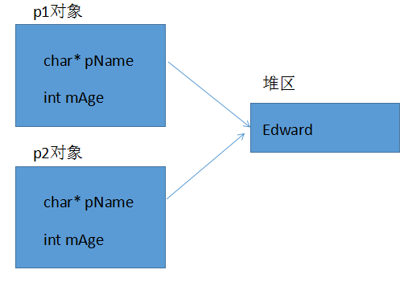
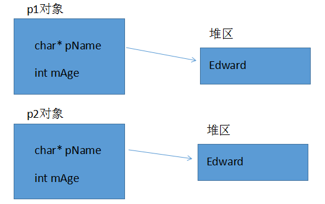
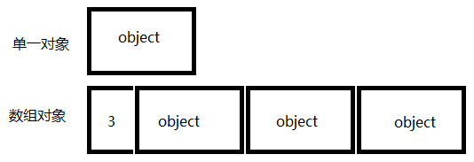
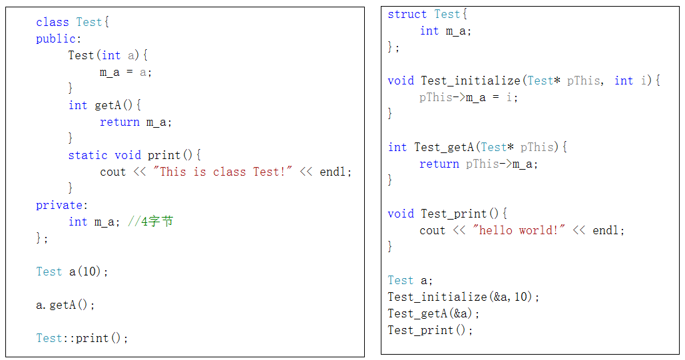
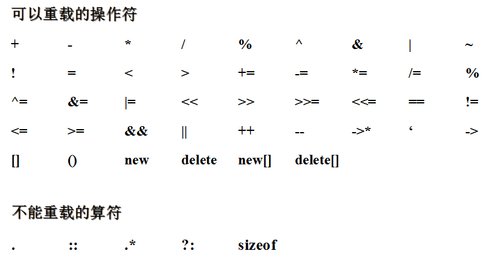
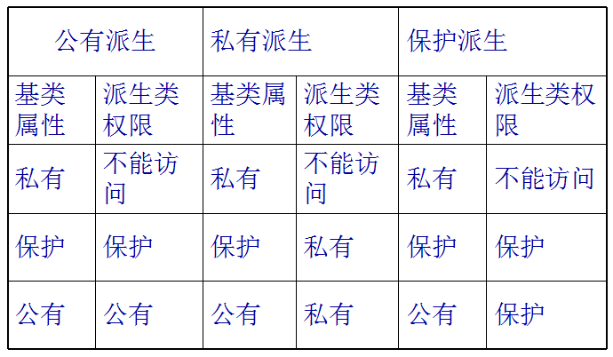

##          C++对C的扩展  

####  ::作用域运算符  

通常情况下，如果有两个同名变量，一个是全局变量，另一个是局部变量，**那么局部变量在其作用域内具有较高的优先权，它将屏蔽全局变量**。

```
//全局变量
int a = 10;
void test(){
	//局部变量
	int a = 20;
	//全局a被隐藏
	cout << "a:" << a << endl;
}

```

程序的输出结果是a:20。在test函数的输出语句中，使用的变量a是test函数内定义的局部变量，因此输出的结果为局部变量a的值。

**作用域运算符可以用来解决局部变量与全局变量的重名问题** 

```
//全局变量
int a = 10;
//1. 局部变量和全局变量同名
void test(){
	int a = 20;
	//打印局部变量a
	cout << "局部变量a:" << a << endl;
	//打印全局变量a
	cout << "全局变量a:" << ::a << endl;
}

```

这个例子可以看出，作用域运算符可以用来解决局部变量与全局变量的重名问题，即在局部变量的作用域内，可用**::对被屏蔽的同名的全局变量进行访问**。

#### 名字控制  

​	创建名字是程序设计过程中一项最基本的活动，当一个项目很大时，它会不可避免地包含大量名字。c++允许我们对名字的产生和名字的可见性进行控制。

我们之前在学习c语言可以通过static关键字来使得名字只得在本编译单元内可见，在c++中我们将通过一种通过**命名空间**来控制对名字的访问。

- **C++命名空间(namespace)**  
  
- 在c++中，名称（name）可以是符号常量、变量、函数、结构、枚举、类和对象等等。**工程越大，名称互相冲突性的可能性越大**。另外使用多个厂商的类库时，也可能导致名称冲突。为了避免，在大规模程序的设计中，以及在程序员使用各种各样的C++库时，这些标识符的命名发生冲突，**标准C++引入关键字namespace（命名空间/名字空间/名称空间），可以更好地控制标识符的作用域。**
  
- **命名空间使用语法** 

  - **创建一个命名空间**   

    ```
    namespace A{
    	int a = 10;
    }
    namespace B{
    	int a = 20;
    }
    void test(){
    	cout << "A::a : " << A::a << endl;
    	cout << "B::a : " << B::a << endl;
    }
    
    ```

  -  **命名空间只能全局范围内定义**（**以下错误写法**）

    - ```
      void test(){
      	namespace A{
      		int a = 10;
      	}
      	namespace B{
      		int a = 20;
      	}
      	cout << "A::a : " << A::a << endl;
      	cout << "B::a : " << B::a << endl;
      }
      error 的写法
      
      ```

  - 命名空间可嵌套命名空间

    - ```
      namespace A{
      	int a = 10;
      	namespace B{
      		int a = 20;
      	}
      }
      void test(){
      	cout << "A::a : " << A::a << endl;
      	cout << "A::B::a : " << A::B::a << endl;
      }
      
      ```

  -  命名空间是开放的，**即可以随时把新的成员加入已有的命名空间中**

    - ```
      namespace A{
      	int a = 10;
      }
      
      namespace A{
      	void func(){
      		cout << "hello namespace!" << endl;
      	}
      }
      
      void test(){
      	cout << "A::a : " << A::a << endl;
      	A::func();
      }
      
      ```

  - 声明和实现可分离

    - ```
      #pragma once
      
      namespace MySpace{
      	void func1();
      	void func2(int param);
      }
      
      void MySpace::func1(){
      	cout << "MySpace::func1" << endl;
      }
      void MySpace::func2(int param){
      	cout << "MySpace::func2 : " << param << endl;
      }
      
      ```

  -  **无名命名空间，意味着命名空间中的标识符只能在本文件内访问，相当于给这个标识符加上了static**，使得其可以作为内部连接

    - ```
      namespace{
      	
      	int a = 10;
      	void func(){ cout << "hello namespace" << endl; }
      }
      void test(){
      	cout << "a : " << a << endl;
      	func();
      }
      
      ```

  - 命名空间别名

    - ```
      namespace veryLongName{
      	
      	int a = 10;
      	void func(){ cout << "hello namespace" << endl; }
      }
      
      void test(){
      	namespace shortName = veryLongName;
      	cout << "veryLongName::a : " << shortName::a << endl;
      	veryLongName::func();
      	shortName::func();
      }
      
      ```

- **using声明**  

  using声明可**使得指定的标识符可用。**

  ```
  namespace A{
  	int paramA = 20;
  	int paramB = 30;
  	void funcA(){ cout << "hello funcA" << endl; }
  	void funcB(){ cout << "hello funcA" << endl; }
  }
  
  void test(){
  	//1. 通过命名空间域运算符
  	cout << A::paramA << endl;
  	A::funcA();
  	//2. using声明
  	using A::paramA;
  	using A::funcA;
  	cout << paramA << endl;
  	//cout << paramB << endl; //不可直接访问
  	funcA();
  	//3. 同名冲突
  	//int paramA = 20; //相同作用域注意同名冲突
  }
  
  ```

  using声明碰到函数重载

  ```
  namespace A{
  	void func(){}
  	void func(int x){}
  	int  func(int x,int y){}
  }
  void test(){
  	using A::func;
  	func();
  	func(10);
  	func(10, 20);
  }
  
  ```

   如果命名空间包含一组用相同名字重载的函数，**using声明就声明了这个重载函数的所有集合**  

- **using编译指令**  

  using编译指令**使整个命名空间标识符可用**.

  ```
  namespace A{
  	int paramA = 20;
  	int paramB = 30;
  	void funcA(){ cout << "hello funcA" << endl; }
  	void funcB(){ cout << "hello funcB" << endl; }
  }
  
  void test01(){
  	using namespace A;
  	cout << paramA << endl;
  	cout << paramB << endl;
  	funcA();
  	funcB();
  
  	//不会产生二义性
  	int paramA = 30;
  	cout << paramA << endl;
  }
  
  namespace B{
  	int paramA = 20;
  	int paramB = 30;
  	void funcA(){ cout << "hello funcA" << endl; }
  	void funcB(){ cout << "hello funcB" << endl; }
  }
  
  void test02(){
  	using namespace A;
  	using namespace B;
  	//二义性产生，不知道调用A还是B的paramA
  	//cout << paramA << endl;
  }
  
  ```

  ​         **注意：使用using声明或using编译指令会增加命名冲突的可能性。也就是说，如果有名称空间，并在代码中使用作用域解析运算符，则不会出现二义性。**  

- **命名空间使用**  

  我们刚讲的一些东西一开始会觉得难一些，这些东西以后还是挺常用，只要理解了它们的工作机理，使用它们非常简单。

  需要记住的关键问题是**当引入一个全局的using编译指令时，就为该文件打开了该命名空间**，它不会影响任何其他的文件，所以可以在每一个实现文件中调整对命名空间的控制。比如，如果发现某一个实现文件中有太多的using指令而产生的命名冲突，就要对该文件做个简单的改变，**通过明确的限定或者using声明来消除名字冲突**，这样不需要修改其他的实现文件。

#### 全局变量检测增强  

​	c语言代码：

```
int a = 10; //赋值，当做定义
int a; //没有赋值，当做声明

int main(){
	printf("a:%d\n",a);
	return EXIT_SUCCESS;
}

```

​	**此代码在c++下编译失败,在c下编译通过.**

#### C++中所有的变量和函数都必须有类型

- **c语言代码**：

  ```
  //i没有写类型，可以是任意类型
  int fun1(i){
  	printf("%d\n", i);
  	return 0;
  }
  //i没有写类型，可以是任意类型
  int fun2(i){
  	printf("%s\n", i);
  	return 0;
  }
  //没有写参数，代表可以传任何类型的实参
  int fun3(){ 
  	printf("fun33333333333333333\n");
  	return 0;
  }
  
  //C语言，如果函数没有参数，建议写void，代表没有参数
  int fun4(void){
  	printf("fun4444444444444\n");
  	return 0;
  }
  
  g(){
  	return 10;
  }
  
  int main(){
  
  	fun1(10);
  	fun2("abc");
  	fun3(1, 2, "abc");
  	printf("g = %d\n", g());
  
  	return 0;
  }
  
  ```

  以上c代码c编译器编译可通过，c++编译器无法编译通过。

-  在C语言中，int fun() 表示返回值为int，接受任意参数的函数，int fun(void) 表示返回值为int的无参函数。

- 在C++ 中，int fun() 和int fun(void) 具有相同的意义，都表示返回值为int的无参函数。

####  更严格的类型转换  

在C++，不同类型的变量一般是不能直接赋值的，需要相应的强转。

 c语言代码 

```
typedef enum COLOR{ GREEN, RED, YELLOW } color;
int main(){

	color mycolor = GREEN;
	mycolor = 10;
	printf("mycolor:%d\n", mycolor);
	char* p = malloc(10);
	return EXIT_SUCCESS;
}

```

以上c代码c编译器编译可通过，c++编译器无法编译通过。

#### struct类型加强  

-  c中定义结构体变量需要加上struct关键字，c++不需要。

- c中的结构体只能定义成员变量，不能定义成员函数。c++即可以定义成员变量，也可以定义成员函数 .

   

  ```
  //1. 结构体中即可以定义成员变量，也可以定义成员函数
  struct Student{
  	string mName;
  	int mAge;
  	void setName(string name){ mName = name; }
  	void setAge(int age){ mAge = age; }
  	void showStudent(){
  		cout << "Name:" << mName << " Age:" << mAge << endl;
  	}
  };
  
  //2. c++中定义结构体变量不需要加struct关键字
  void test01(){
  	Student student;
  	student.setName("John");
  	student.setAge(20);
  	student.showStudent();
  }
  
  ```

  

####  新增”bool类型关键字

​         标准c++的bool类型有两种内建的常量true(转换为整数1)和false(转换为整数0)表示状态。这三个名字都是关键字  

-  bool类型只有两个值，true(1值)，false(0值)

- bool类型占1个字节大小

- 给bool类型赋值时，非0值会自动转换为true(1),0值会自动转换false(0)

  ```
  void test()
  {	cout << sizeof(false) << endl; //为1，//bool类型占一个字节大小
  	bool flag = true; // c语言中没有这种类型
  	flag = 100; //给bool类型赋值时，非0值会自动转换为true(1),0值会自动转换false(0)
  }
  ```

- **[c语言中的bool类型]**

  c语言中也有bool类型，在c99标准之前是没有bool关键字，c99标准已经有bool类型，包含头文件stdbool.h,就可以使用和c++一样的bool类型。

#### 三目运算符功能增强  

- **c语言三目运算表达式返回值为数据值，为右值，不能赋值。**  

  - ```
    int a = 10;
    int b = 20;
    printf("ret:%d\n", a > b ? a : b);
    //思考一个问题，(a > b ? a : b) 三目运算表达式返回的是什么？
    	
    //(a > b ? a : b) = 100;
    //返回的是右值
    
    ```

- **c++语言三目运算表达式返回值为变量本身(引用)，为左值，可以赋值。**

  - ```
    int a = 10;
    int b = 20;
    printf("ret:%d\n", a > b ? a : b);
    //思考一个问题，(a > b ? a : b) 三目运算表达式返回的是什么？
    
    cout << "b:" << b << endl;
    //返回的是左值，变量的引用
    (a > b ? a : b) = 100;//返回的是左值，变量的引用
    cout << "b:" << b << endl;
    
    ```

-  **[左值和右值概念]**

    在c++中可以放在**赋值操作符左边的是左值，可以放到赋值操作符右面的是右值。**

    有些变量即可以当左值，也可以当右值。

    左值为Lvalue，L代表Location，表示内存可以寻址，可以赋值。

    右值为Rvalue，R代表Read,就是可以知道它的值。

    比如:int temp = 10; temp在内存中有地址，10没有，但是可以Read到它的值。

#### C/C++中的const  

**const概述**  

const单词字面意思为常数，不变的。它是c/c++中的一个关键字，是一个限定符，它用来限定一个变量不允许改变，它将一个对象转换成一个常量。	

```
const int a = 10;
A = 100; //编译错误,const是一个常量，不可修改
```

**C/C++中const的区别**  

**C中的const**   

- 常量的引进是在c++早期版本中，当时标准C规范正在制定。那时，尽管C委员会决定在C中引入const,但是，他们c中的const理解为”一个不能改变的普通变量”，也就是认为const应该是一个只读变量，既然是变量那么就会给const分配内存，并且在c中const是一个全局只读变量，c语言中const修饰的只读变量是外部连接的。

  如果这么写:

  ```
  const int arrSize = 10;
  int arr[arrSize]; //会报错。因为arrSize占用某块内存，所以C编译器不知道它在编译时的值是多少
  
  ```

  看似是一件合理的编码，**但是这将得出一个错误。 因为arrSize占用某块内存，所以C编译器不知道它在编译时的值是多少？**

**C++中的const** 

- **在c++中，一个const不必创建内存空间，而在c中，一个const总是需要一块内存空间。****在c++中，是否为const常量分配内存空间依赖于如何使用**。一般说来，如果一个const仅仅用来把一个名字用一个值代替(就像使用#define一样)，那么该存储局空间就不必创建。

  如果存储空间没有分配内存的话，在进行完数据类型检查后，为了代码更加有效，值也许会折叠到代码中。

  不过，取一个const地址, 或者把它定义为extern,则会为该const创建内存空间。

   在c++中，出现在所有函数之外的const作用于整个文件(也就是说它在该文件外不可见)，默认为内部连接，c++中其他的标识符一般默认为外部连接 

**C/C++中const异同总结**  

- **c语言全局const**会被存储到只读数据段。c++中全局const当声明extern或者对变量取地址时，编译器会分配存储地址，变量存储在只读数据段。两个都受到了只读数据段的保护，不可修改  

  ```
  const int constA = 10;
  int main(){
      int* p = (int*)&constA;
      *p = 200;
  }
  ```

  ​         以上代码在c/c++中编译通过，在运行期，修改constA的值时，发生写入错误。原因是修改只读数据段的数据  

   （两个都受到了只读数据段的保护，不可修改。） 

 **c语言中局部const**存储在堆栈区，只是不能通过变量直接修改const只读变量的值，但是可以跳过编译器的检查，通过指针间接修改const值。

​	

```
const int constA = 10;
	int* p = (int*)&constA;
	*p = 300;
	printf("constA:%d\n",constA);
	printf("*p:%d\n", *p);

```

运行结果：

  constA:300

  *p:300

**c语言中，通过指针间接赋值修改了constA的值**  

c++中对于局部的const变量要区别对待：  

 对于基础数据类型，也就是const int a = 10这种，**编译器会把它放到符号表中，不分配内存，当对其取地址时，会分配内存。**

```
	const int constA = 10;
	int* p = (int*)&constA;
	*p = 300;
	cout << "constA:" << constA << endl;
	cout << "*p:" << *p << endl;

```

运行结果：

  constA:10

  *p:300

**constA在符号表中，当我们对constA取地址，这个时候为constA分配了新的空间，*p操作的是分配的空间，而constA是从符号表获得的值**。

- 对于基础数据类型，**如果用一个变量初始化const变量，如果const int a = b,那么也是会给a分配内存。**

  - ```
    int b = 10;
    const int constA = b;
    int* p = (int*)&constA;
    *p = 300;
    cout << "constA:" << constA << endl;
    cout << "*p:" << *p << endl;
    
    ```

    运行结果：

      constA:300

      *p:300

    **constA 分配了内存，所以我们可以修改constA内存中的值**。

对于自定数据类型，比如类对象，那么也会分配内存  

- ```
  const Person person; //未初始化age
  //person.age = 50; //不可修改
  Person* pPerson = (Person*)&person;
  //指针间接修改
  pPerson->age = 100;
  cout << "pPerson->age:" << pPerson->age << endl;
  pPerson->age = 200;
  cout << "pPerson->age:" << pPerson->age << endl;
  
  ```

  运行结果：

  pPersion->age:100

  pPersion-age:200

  **为person分配了内存，所以我们可以通过指针的间接赋值修改person对象**。

 **c中const默认为外部连接，c++中const默认为内部连接**.**当c语言两个文件中都有const int a的时候，编译器会报重定义的错误**。而在c++中，则不会，**因为c++中的const默认是内部连接的**。如果想让c++中的const具有外部连接，必须显示声明为: extern const int a = 10;

**了解: 能否用变量定义数组:**

- ```
  在支持c99标准的编译器中，可以使用变量定义数组。
  1. 微软官方描述vs2013编译器不支持c99.：
  Microsoft C conforms to the standard for the C language as set forth in the 9899:1990 edition of the ANSI C standard. 
  2. 以下代码在Linux GCC支持c99编译器编译通过
  -----------------------------------
  int a = 10;
  int arr[a];
  int i = 0;
  for(;i<10;i++) 
  	arr[i] = i;
  i = 0;
  for(;i<10;i++)
  	printf("%d\n",arr[i]);
  
  ```

**尽量以const替换#define**  

​	在旧版本C中，如果想建立一个常量，必须使用预处理器”

\#define MAX 1024;

**我们定义的宏MAX从未被编译器看到过，因为在预处理阶段，所有的MAX已经被替换为了1024**，于是MAX并没有将其加入到符号表中。但我们使用这个常量获得一个编译错误信息时，可能会带来一些困惑，因为这个信息可能会提到1024，但是并没有提到MAX.如果MAX被定义在一个不是你写的头文件中，你可能并不知道1024代表什么，也许解决这个问题要花费很长时间。

解决办法就是用一个常量替换上面的宏。

const int max= 1024;


**const和#define区别总结:**

​	**const有类型**，可进行编译器类型安全检查。#define无类型，不可进行类型检查.

​	**const有作用域**，而#define不重视作用域，默认定义处到文件结尾.如果定义在指定作用域下有效的常量，那么#define就不能用。

1. **宏常量没有类型**，所以调用了int类型重载的函数。**const有类型**，所以调用希望的short类型函数？

   ```
   #define PARAM 128
   
   const short param = 128;
   
   void func(short a){
   	cout << "short!" << endl;
   }
   void func(int a){
   	cout << "int" << endl;
   }
   
   ```

   **2，宏常量不重视作用域.**  

   ```
   void func1(){
   	const int a = 10;
   	#define A 20 
       //#undef A  //卸载宏常量A
   }
   void func2(){
   	//cout << "a:" << a << endl; //不可访问，超出了const int a作用域
   	cout << "A:" << A << endl; //#define作用域从定义到文件结束或者到#undef，可访问
   }
   int main(){
   	func2();
   	return EXIT_SUCCESS;
   }
   
   ```

   **问题:** 宏常量可以有命名空间吗？

    **++中，宏定义不受命名空间的约束** 

```
namespace MySpace{
	#define num 1024
}
void test(){
	//cout << MySpace::NUM << endl; //错误
	//int num = 100; //命名冲突
	cout << num << endl;
}

```

#### 引用

- **引用基本用法**  

  - **引用是c++对c的重要扩充。**在c/c++中指针的作用基本都是一样的，但是c++增加了另外一种给函数传递地址的途径，这就是按引用传递(pass-by-reference)，它也存在于其他一些编程语言中，并不是c++的发明。

  - **变量名实质上是一段连续内存空间的别名，是一个标号**(门牌号)

  -  程序中通过变量来申请并命名内存空间

  -  通过变量的名字可以使用存储空间

  - **对一段连续的内存空间只能取一个别名吗？**

    c++中新增了引用的概念，引用可以作为一个已定义变量的别名

    基本语法

    ```
    Type& ref = val;
    ```

  - &在此不是求地址运算，**而是起标识作用。**

  - 类型标识符是指目标变量的类型

  - **必须在声明引用变量时进行初始化**。

  - 引用初始化之后不能改变  

  - 不能有NULL引用。必须确保引用是和一块合法的存储单元关联  

  -  **可以建立对数组的引用。**

  - ```c++
    //1. 认识引用
    void test01(){
    
    	int a = 10;
    	//给变量a取一个别名b
    	int& b = a;
    	cout << "a:" << a << endl;
    	cout << "b:" << b << endl;
    	cout << "------------" << endl;
    	//操作b就相当于操作a本身
    	b = 100;
    	cout << "a:" << a << endl;
    	cout << "b:" << b << endl;
    	cout << "------------" << endl;
    	//一个变量可以有n个别名
    	int& c = a;
    	c = 200;
    	cout << "a:" << a << endl;
    	cout << "b:" << b << endl;
    	cout << "c:" << c << endl;
    	cout << "------------" << endl;
    	//a,b,c的地址都是相同的
    	cout << "a:" << &a << endl;
    	cout << "b:" << &b << endl;
    	cout << "c:" << &c << endl;
    }
    //2. 使用引用注意事项
    void test02(){
    	//1) 引用必须初始化
    	//int& ref; //报错:必须初始化引用
    	//2) 引用一旦初始化，不能改变引用
    	int a = 10;
    	int b = 20;
    	int& ref = a;
    	ref = b; //不能改变引用
    	//3) 不能对数组建立引用
    	int arr[10];
    	//int& ref3[10] = arr;
    }
    
    	//1. 建立数组引用方法一
    	typedef int ArrRef[10];
    	int arr[10];
    	ArrRef& aRef = arr;
    	for (int i = 0; i < 10;i ++){
    		aRef[i] = i+1;
    	}
    	for (int i = 0; i < 10;i++){
    		cout << arr[i] << " ";
    	}
    	cout << endl;
    	//2. 建立数组引用方法二
    	int(&f)[10] = arr;
    	for (int i = 0; i < 10; i++){
    		f[i] = i+10;
    	}
    	for (int i = 0; i < 10; i++){
    		cout << arr[i] << " ";
    	}
    	cout << endl;
    
    ```

- **函数中的引用**  

  最常见看见引用的地方是在函数参数和返回值中。当引用被用作函数参数的时，在函数内对任何引用的修改，将对还函数外的参数产生改变。当然，**可以通过传递一个指针来做相同的事情，但引用具有更清晰的语法**。

  如果从函数中返回一个引用，必须像从函数中返回一个指针一样对待。**当函数返回值时，引用关联的内存一定要存在**

  ```c++
  //值传递
  void ValueSwap(int m,int n){
  	int temp = m;
  	m = n;
  	n = temp;
  }
  //地址传递
  void PointerSwap(int* m,int* n){
  	int temp = *m;
  	*m = *n;
  	*n = temp;
  }
  //引用传递
  void ReferenceSwap(int& m,int& n){
  	int temp = m;
  	m = n;
  	n = temp;
  }
  void test(){
  	int a = 10;
  	int b = 20;
  	//值传递
  	ValueSwap(a, b);
  	cout << "a:" << a << " b:" << b << endl;
  	//地址传递
  	PointerSwap(&a, &b);
  	cout << "a:" << a << " b:" << b << endl;
  	//引用传递
  	ReferenceSwap(a, b);
  	cout << "a:" << a << " b:" << b << endl;
  }
  
  ```

通过引用参数产生的效果同按地址传递是一样的。引用的语法更清楚简单：  

1) 函数调用时传递的实参不必加“&”符 

2) 在被调函数中不必在参数前加“*”符

引用作为其它变量的别名而存在，因此在一些场合可以代替指针。C++主张用引用传递取代地址传递的方式，因为**引用语法容易且不易出错**。

```c++
//返回局部变量引用
int& TestFun01(){
	int a = 10; //局部变量
	return a;
}
//返回静态变量引用
int& TestFunc02(){	
	static int a = 20;
	cout << "static int a : " << a << endl;
	return a;
}
int main(){
	//不能返回局部变量的引用
	int& ret01 = TestFun01();
	//如果函数做左值，那么必须返回引用
	TestFunc02(); //error
	TestFunc02() = 100;
	TestFunc02();

	return EXIT_SUCCESS;
}

```

​		**不能返回局部变量的引用。**

​      **函数当左值，必须返回引用**  

- **引用的本质** 

**引用的本质在c++内部实现是一个指针常量.**

```
Type& ref = val; // Type* const ref = &val;
```

c++编译器在编译过程中使用**常指针**作为引用的内部实现，**因此引用所占用的空间大小与指针相同，只是这个过程是编译器内部实现，用户不可见。**

```c++
//发现是引用，转换为 int* const ref = &a;
void testFunc(int& ref){
	ref = 100; // ref是引用，转换为*ref = 100
}
int main(){
	int a = 10;
	int& aRef = a; //自动转换为 int* const aRef = &a;这也能说明引用为什么必须初始化
	aRef = 20; //内部发现aRef是引用，自动帮我们转换为: *aRef = 20;
	cout << "a:" << a << endl;
	cout << "aRef:" << aRef << endl;
	testFunc(a);
	return EXIT_SUCCESS;
}

```

- **指针引用**  

  在c语言中如果想改变一个指针的指向而不是它所指向的内容，函数声明可能这样  

   void fun**(**int***\*);**  

  给指针变量取一个别名。

  ```
  Type* pointer = NULL;  
  
  Type*& = pointer;
  ```

  ```c++
  struct Teacher{
  	int mAge;
  };
  //指针间接修改teacher的年龄
  void AllocateAndInitByPointer(Teacher** teacher){
  	*teacher = (Teacher*)malloc(sizeof(Teacher));
  	(*teacher)->mAge = 200;  
  }
  //引用修改teacher年龄
  void AllocateAndInitByReference(Teacher*& teacher){
  	teacher->mAge = 300;
  }
  void test(){
  	//创建Teacher
  	Teacher* teacher = NULL;
  	//指针间接赋值
  	AllocateAndInitByPointer(&teacher);
  	cout << "AllocateAndInitByPointer:" << teacher->mAge << endl;
  	//引用赋值,将teacher本身传到ChangeAgeByReference函数中
  	AllocateAndInitByReference(teacher);
  	cout << "AllocateAndInitByReference:" << teacher->mAge << endl;
  	free(teacher);
  }
  
  ```

  对于c++中的定义那个，语法清晰多了。函数参数变成指针的引用，**用不着取得指针的地址**。

- **常量引用**  

  - 常量引用的定义格式:
  - ​         const Type**&** ref **=** val**;**  
    

  **常量引用注意**  

  -  **字面量不能赋给引用，但是可以赋给const引用**

  - **const修饰的引用，不能修改**  

    - ```c++
      void test01(){
      	int a = 100;
      	const int& aRef = a; //此时aRef就是a
      	//aRef = 200; 不能通过aRef的值
      	a = 100; //OK
      	cout << "a:" << a << endl;
      	cout << "aRef:" << aRef << endl;
      }
      void test02(){
      	//不能把一个字面量赋给引用
      	//int& ref = 100;
      	//但是可以把一个字面量赋给常引用
      	const int& ref = 100; //int temp = 200; const int& ret = temp;
      }
      
      ```

     **[const引用使用场景]**

    -   常量引用主要用在函数的形参，尤其是类的拷贝/复制构造函数。

    **将函数的形参定义为常量引用的好处:**

    -  引用不产生新的变量，减少形参与实参传递时的开销。

    -  由于引用可能导致实参随形参改变而改变，将其定义为常量引用可以消除这种副作用。

    -   如果希望实参随着形参的改变而改变，那么使用一般的引用，如果不希望实参随着形参改变，那么使用常引用。

  

  ```
  //const int& param防止函数中意外修改数据
  void ShowVal(const int& param){
  	cout << "param:" << param << endl;
  }
  ```

#### **内联函数**

- **内联函数的引出**  

  - ​	c++从c中继承的一个重要特征就是效率。假如c++的效率明显低于c的效率，那么就会有很大的一批程序员不去使用c++了。

  ​	在c中我们经常把一些**短并且执行频繁的计算写成宏，而不是函数**，这样做的理由是为了执行效率，**宏可以避免函数调用的开销，这些都由预处理来完成**。

  -  但是在c++出现之后，使用预处理宏会出现两个问题  
    - 第一个在c中也会出现，宏看起来像一个函数调用，但是会有隐藏一些难以发现的错误。
    - 第二个问题是c++特有的，预处理器不允许访问类的成员，也就是说预处理器宏不能用作类类的成员函数  
  - 为了保持预处理宏的效率又增加安全性，而且还能像一般成员函数那样可以在类里访问自如，c++引入了**内联函数(inline function)**.
  - 内联函数为了**继承宏函数的效率**，**没有函数调用时开销**，然后又可以像普通函数那样，**可以进行参数，返回值类型的安全检查**，又可**以作为成员函数。**

- **预处理宏的缺陷**  

  - 预处理器宏存在问题的关键是我们可能认为预处理器的行为和编译器的行为是一样的。当然也是由于宏函数调用和函数调用在外表看起来是一样的，因为也容易被混淆。但是其中也会有一些微妙的问题出现  

  - **问题一**：

    ```c++
    #define ADD(x,y) x+y
    inline int Add(int x,int y){
    	return x + y;
    }
    void test(){
    	int ret1 = ADD(10, 20) * 10; //希望的结果是300
    	int ret2 = Add(10, 20) * 10; //希望结果也是300
    	cout << "ret1:" << ret1 << endl; //210
    	cout << "ret2:" << ret2 << endl; //300
    }
    
    ```

  - **问题二：**

    - ```c++
      #define COMPARE(x,y) ((x) < (y) ? (x) : (y))
      int Compare(int x,int y){
      	return x < y ? x : y;
      }
      void test02(){
      	int a = 1;
      	int b = 3;
      	//cout << "COMPARE(++a, b):" << COMPARE(++a, b) << endl; // 3
      	cout << "Compare(int x,int y):" << Compare(++a, b) << endl; //2
      }
      
      ```

  - **问题三:**

    - **预定义宏函数没有作用域概念**，**无法作为一个类的成员函数**，也就是说预定义宏没有办法表示类的范围。

- **内联函数基本概念**

  ​	在c++中，预定义宏的概念是用内联函数来实现的，而**内联函数本身也是一个真正的函数**。内联函数具有普通函数的所有行为。**唯一不同之处在于内联函数会在适当的地方像预定义宏一样展开，所以不需要函数调用的开销**。因此应该不使用宏，使用内联函数。
  
  ​	注意必须函数体和声明结合在一起，否则编译器将它作为普通函数来对待
  
  ```c++
  inline void func(int a);
  ```
  
  以上写法没有任何效果，仅仅是声明函数，应该如下方式来做:
  
  ```c++
  inline int func(int a){return ++;}
  ```
  
  ​	注意: **编译器将会检查函数参数列表使用是否正确，并返回值(进行必要的转换)**。这些事预处理器无法完成的。
  
  内联函数**的确占用空间**，但是内联函数相对于普通函数的优势只是省去了**函数调用时候的压栈，跳转，返回的开销**。我们可以理解为内联函数是以**空间换时间**

- **类内部的内联函数**

   为了定义内联函数，**通常必须在函数定义前面放一个inline关键字**。但是在类内部定义内联函数时并不是必须的。**任何在类内部定义的函数自动成为内联函数。**

  ```c++
  class Person{
  public:
  	Person(){ cout << "构造函数!" << endl; }
  	void PrintPerson(){ cout << "输出Person!" << endl; }
  }
  ```

     **构造函数Person，成员函数PrintPerson在类的内部定义，自动成为内联函数。**
  
  **成员函数体写在类外部的一定不是内联函数，写在类内部的一定是内联函数。**

- **内联函数和编译器**

  - 内联函数并不是何时何地都有效，为了理解内联函数何时有效，应该要知道编译器碰到内联函数会怎么处理？

    对于任何类型的函数，编译器会将函数类型(包括函数名字，参数类型，返回值类型)放入到符号表中。同样，当编译器看到内联函数，并且对内联函数体进行分析没有发现错误时，也会将内联函数放入符号表。

    当调用一个内联函数的时候，编译器首先确保传入参数类型是正确匹配的，或者如果类型不正完全匹配，但是可以将其转换为正确类型，并且返回值在目标表达式里匹配正确类型，或者可以转换为目标类型，内联函数就会直接替换函数调用，这就消除了函数调用的开销。假如内联函数是成员函数，对象this指针也会被放入合适位置。

    类型检查和类型转换、包括在合适位置放入对象this指针这些都是预处理器不能完成的。

     

    但是c++内联编译会有一些限制，以下情况编译器可能考虑不会将函数进行内联编译：

    **不能存在任何形式的循环语句**

     **不能存在过多的条件判断语句**

     **函数体不能过于庞大**

    **不能对函数进行取址操作**

  **内联仅仅只是给编译器一个建议，编译器不一定会接受这种建议，如果你没有将函数声明为内联函数，那么编译器也可能将此函数做内联编译。一个好的编译器将会内联小的、简单的函数。**

- **函数的默认参数**

  - c++在声明函数原型的时可为一个或者多个参数指定默认(缺省)的参数值，**当函数调用的时候如果没有指定这个值，编译器会自动用默认值代替**。

  - ```c++
    void TestFunc01(int a = 10, int b = 20){
    	cout << "a + b  = " << a + b << endl;
    }
    //注意点:
    //1. 形参b设置默认参数值，那么后面位置的形参c也需要设置默认参数
    void TestFunc02(int a,int b = 10,int c = 10){}
    //2. 如果函数声明和函数定义分开，函数声明设置了默认参数，函数定义不能再设置默认参数
    void TestFunc03(int a = 0,int b = 0);
    void TestFunc03(int a, int b){}
    
    int main(){
    	//1.如果没有传参数，那么使用默认参数
    	TestFunc01();
    	//2. 如果传一个参数，那么第二个参数使用默认参数
    	TestFunc01(100);
    	//3. 如果传入两个参数，那么两个参数都使用我们传入的参数
    	TestFunc01(100, 200);
    
    	return EXIT_SUCCESS;
    }
    
    ```

    - 函数的默认参数从左向右，如果一个参数设置了默认参数，那么这个参数之后的参数都必须设置默认参数。

    - 如果函数声明和函数定义分开写，函数声明和函数定义不能同时设置默认参数

  #### **函数的占位参数**

  ​		c++在声明函数时，可以设置占位参数。占位参数只有参数类型声明，而没有参数名声明。一般情况下，在函数体内部无法使用占位参数。

  ​		

  ```c++
  void TestFunc01(int a,int b,int){
  	//函数内部无法使用占位参数
  	cout << "a + b = " << a + b << endl;
  }
  //占位参数也可以设置默认值
  void TestFunc02(int a, int b, int = 20){
  	//函数内部依旧无法使用占位参数
  	cout << "a + b = " << a + b << endl;
  }
  int main(){
  
  	//错误调用，占位参数也是参数，必须传参数
  	//TestFunc01(10,20); 
  	//正确调用
  	TestFunc01(10,20,30);
  	//正确调用
  	TestFunc02(10,20);
  	//正确调用
  	TestFunc02(10, 20, 30);
  
  	return EXIT_SUCCESS;
  }
  
  ```

#### 函数重载(overload)

- **函数重载概述**
  
- **能使名字方便使用，是任何程序设计语言的一个重要特征！**
  
- **函数重载基本语法**

  - **实现函数重载的条件：**

    - 同一个作用域

      参数个数不同

      参数类型不同

      参数顺序不同

    - ```
      //1. 函数重载条件
      namespace A{
      	void MyFunc(){ cout << "无参数!" << endl; }
      	void MyFunc(int a){ cout << "a: " << a << endl; }
      	void MyFunc(string b){ cout << "b: " << b << endl; }
      	void MyFunc(int a, string b){ cout << "a: " << a << " b:" << b << endl;}
          void MyFunc(string b, int a){cout << "a: " << a << " b:" << b << endl;}
      }
      //2.返回值不作为函数重载依据
      namespace B{
      	void MyFunc(string b, int a){}
      	//int MyFunc(string b, int a){} //无法重载仅按返回值区分的函数
      }
      
      ```

      **注意:** 函数重载和默认参数一起使用，**需要额外注意二义性问题的产生**。

      ```c++
      void MyFunc(string b){
      	cout << "b: " << b << endl;
      }
      //函数重载碰上默认参数
      void MyFunc(string b, int a = 10){
      	cout << "a: " << a << " b:" << b << endl;
      }
      int main(){
      	MyFunc("hello"); //这时，两个函数都能匹配调用，产生二义性
      	return 0;
      }
      
      ```

      ​	**思考：**为什么函数返回值不作为重载条件呢？

         当编译器能从上下文中确定唯一的函数的时，如int ret = func(),这个当然是没有问题的。然而，我们在编写程序过程中可以忽略他的返回值。那么这个时候,一个函数为

      void func(int x);另一个为int func(int x); 当我们直接调用func(10),这个时候编译器就不确定调用那个函数。所以在c++中禁止使用返回值作为重载的条件。

- **函数重载实现原理**

  - 编译器为了实现函数重载，也是默认为我们做了一些幕后的工作，编译器用不同的参数类型来修饰不同的函数名，比如void func(); 编译器可能会将函数名修饰成_func，当编译器碰到void func(int x),编译器可能将函数名修饰为_func_int,当编译器碰到void func(int x,char c),**编译器可能会将函数名修饰为_func_int_char我这里使用”可能”这个字眼是因为编译器如何修饰重载的函数名称并没有一个统一的标准，所以不同的编译器可能会产生不同的内部名。**

    ```c++
    void func(){}
    void func(int x){}
    void func(int x,char y)
    以上三个函数在linux下生成的编译之后的函数名为:
    _Z4funcv //v 代表void,无参数
    _Z4funci //i 代表参数为int类型
    _Z4funcic //i 代表第一个参数为int类型，第二个参数为char类型
    
    ```

- **extern “C”浅析**

  - 以下在Linux下测试:

  ```c++
  c函数: void MyFunc(){} ,被编译成函数: MyFunc
  c++函数: void MyFunc(){},被编译成函数: _Z6Myfuncv
  
  ```

  通过这个测试，由于c++中需要支持函数重载，**所以c和c++中对同一个函数经过编译后生成的函数名是不相同的**，这就导致了一个问题，如果在c++中调用一个使用c语言编写模块中的某个函数，那么c++是根据c++的名称修饰方式来查找并链接这个函数，那么就会发生链接错误，以上例，c++中调用MyFunc函数，在链接阶段会去找Z6Myfuncv，结果是没有找到的，因为这个MyFunc函数是c语言编写的，生成的符号是MyFunc。

  那么如果我想在c++调用c的函数怎么办？

  extern "C"**的主要作用就是为了实现c++代码能够调用其他c语言代码。加上extern "C"后，这部分代码编译器按c语言的方式进行编译和链接，而不是按c++的方式**。

  **MyModule.h**

  ​	

  ```c++
  #ifndef MYMODULE_H
  #define MYMODULE_H
  
  #include<stdio.h>
  
  #if __cplusplus
  extern "C"{
  #endif
  
  	void func1();
  	int func2(int a,int b);
  
  #if __cplusplus
  }
  #endif
  
  #endif
  
  ```

  **MyModule.c**

  ```c++
  #include"MyModule.h"
  
  void func1(){
  	printf("hello world!");
  }
  int func2(int a, int b){
  	return a + b;
  }
  
  ```

  ```c++
  #define _CRT_SECURE_NO_WARNINGS
  #include<iostream>
  using namespace std;
  
  #if 0
  
  	#ifdef __cplusplus
  	extern "C" {
  		#if 0
  			void func1();
  			int func2(int a, int b);
  		#else
  			#include"MyModule.h"
  		#endif
  	}
  
  	#endif
  
  #else
  
  	extern "C" void func1();
  	extern "C" int func2(int a, int b);
  
  #endif
  
  int main(){
  	func1();
  	cout << func2(10, 20) << endl;
  	return EXIT_SUCCESS;
  }
  
  ```

  

#### 回顾一下指针常量&常量指针

- **指针常量——指针类型的常量（int *const p）**	

```c++
int a = 10, b = 20;
int * const p = &a;
*p = 30; // p指向的地址是一定的，但其内容可以修改
```

-  **常量指针——指向“常量”的指针（const int *p， int const *p）**


 常量指针本质上是一个指针，常量表示指针指向的内容，说明该指针指向一个“常量”。**在常量指针中，指针指向的内容是不可改变的，指针看起来好像指向了一个常量。**用法如下： 

```c++
int a = 10, b = 20;
const int *p = &a;
p = &b; // 指针可以指向其他地址，但是内容不可以改变
```

#### 类和对象的基本概念

- **类和对象的基本概念**

  - **C和C++中struct区别**

    - c语言struct只有变量
    - c++语言struct 既有变量，也有函数

  - **类的封装**

    -  封装

      - **把变量（属性）和函数（操作）合成一个整体，封装在一个类中**
      - **对变量和函数进行访问控制**

    - 访问权限

      - 在类的内部(作用域范围内)，没有访问权限之分，所有成员可以相互访问

      - 在类的外部(作用域范围外)，访问权限才有意义：public，private，protected

      - 在类的外部，只有public修饰的成员才能被访问，在没有涉及继承与派生时，private和protected是同等级的，外部不允许访问

      - | 访问属性  | 属性 | 对象内部 | 对象外部 |
        | --------- | ---- | -------- | -------- |
        | public    | 公有 | 可访问   | 可访问   |
        | protected | 保护 | 可访问   | 不可访问 |
        | private   | 私有 | 可访问   | 不可访问 |

        ```c++
        //封装两层含义
        //1. 属性和行为合成一个整体
        //2. 访问控制，现实事物本身有些属性和行为是不对外开放
        class Person{
        //人具有的行为(函数)
        public:
        	void Dese(){ cout << "我有钱，年轻，个子又高，就爱嘚瑟!" << endl;}
        //人的属性(变量)
        public:
        	int mTall; //多高，可以让外人知道
        protected:
        	int mMoney; // 有多少钱,只能儿子孙子知道
        private:
        	int mAge; //年龄，不想让外人知道
        };
        
        int main(){
        
        	Person p;
        	p.mTall = 220;
        	//p.mMoney 保护成员外部无法访问
        	//p.mAge 私有成员外部无法访问
        	p.Dese();
        
        	return EXIT_SUCCESS;
        }
        
        ```

        **[struct和class的区别?]**

         **class默认访问权限为private,struct默认访问权限为public.**

        ```c++
        class A{
        	int mAge;
        };
        struct B{
        	int mAge;
        };
        
        void test(){
        	A a;
        	B b;
        	//a.mAge; //无法访问私有成员
        	b.mAge; //可正常外部访问
        }
        
        ```

#### 对象的构造和析构

- **初始化和清理**

  同样的使用完一个变量，没有及时清理，也会造成一定的安全问题。c++为了给我们提供这种问题的解决方案，**构造函数**和**析构函数**，**这两个函数将会被编译器自动调用，完成对象初始化和对象清理工作**。

- **构造函数和析构函数**

  - 构造函数主要作用**在于创建对象时为对象的成员属性赋值，构造函数由编译器自动调用，无须手动调用**。

  - **析构函数主要用于对象销毁前系统自动调用，执行一些清理工作**

    - **构造函数语法：**

      - 构造函数函数名和类名相同，没有返回值，不能有void，但可以有参数。

        ClassName(){}

    -   析构函数的语法

      - 析构函数函数名是在类名前面加”~”组成,没有返回值，不能有void,不能有参数，不能重载。

        ~ClassName(){}

      - ```
        class Person{
        public:
        	Person(){
        		cout << "构造函数调用!" << endl;
        		pName = (char*)malloc(sizeof("John"));
        		strcpy(pName, "John");
        		mTall = 150;
        		mMoney = 100;
        	}
        	~Person(){
        		cout << "析构函数调用!" << endl;
        		if (pName != NULL){
        			free(pName);
        			pName = NULL;
        		}
        	}
        public:
        	char* pName;
        	int mTall;
        	int mMoney;
        };
        
        void test(){
        	Person person;
        	cout << person.pName << person.mTall << person.mMoney << endl;
        }
        
        ```

- **构造函数的分类及调用**

  - 按参数类型：分为无参构造函数和有参构造函数

  - 按类型分类：普通构造函数和拷贝构造函数(复制构造函数)

    - ```c++
      class Person{
      public:
      	Person(){
      		cout << "no param constructor!" << endl;
      		mAge = 0;
      	}
      	//有参构造函数
      	Person(int age){
      		cout << "1 param constructor!" << endl;
      		mAge = age;
      	}
      	//拷贝构造函数(复制构造函数) 使用另一个对象初始化本对象
      	Person(const Person& person){
      		cout << "copy constructor!" << endl;
      		mAge = person.mAge;
      	}
      	//打印年龄
      	void PrintPerson(){
      		cout << "Age:" << mAge << endl;
      	}
      private:
      	int mAge;
      };
      //1. 无参构造调用方式
      void test01(){
      	
      	//调用无参构造函数
      	Person person1; 
      	person1.PrintPerson();
      
      	//无参构造函数错误调用方式
      	//Person person2();
      	//person2.PrintPerson();
      }
      //2. 调用有参构造函数
      void test02(){
      	
      	//第一种 括号法，最常用
      	Person person01(100);
      	person01.PrintPerson();
      
      	//调用拷贝构造函数
      	Person person02(person01);
      	person02.PrintPerson();
      
      	//第二种 匿名对象(显示调用构造函数)
      	Person(200); //匿名对象，没有名字的对象
      
      	Person person03 = Person(300);
      	person03.PrintPerson();
      
      	//注意: 使用匿名对象初始化判断调用哪一个构造函数，要看匿名对象的参数类型
      	Person person06(Person(400)); //等价于 Person person06 = Person(400);
      	person06.PrintPerson();
      
      	//第三种 =号法 隐式转换
      	Person person04 = 100; //Person person04 =  Person(100)
      	person04.PrintPerson();
      
      	//调用拷贝构造
      	Person person05 = person04; //Person person05 =  Person(person04)
      	person05.PrintPerson();
      }
      
      ```

      b为A的实例化对象,**A a = A(b) 和 A(b)**的区别？

        当A(b) 有变量来接的时候，那么编译器认为他是一个匿名对象，当没有变量来接的时候，编译器认为你A(b) 等价于 A b.

      **不能调用拷贝构造函数去初始化匿名对象**,也就是说以下代码不正确:

      ```c++
      class Teacher{
      public:
      	Teacher(){
      		cout << "默认构造函数!" << endl;
      	}
      	Teacher(const Teacher& teacher){
      		cout << "拷贝构造函数!" << endl;
      	}
      public:
      	int mAge;
      };
      void test(){
      	
      	Teacher t1;
      	//error C2086:“Teacher t1”: 重定义
      	Teacher(t1);  //此时等价于 Teacher t1;
      }
      
      ```

- **拷贝构造函数的调用时机**

  - **对象以值传递的方式传给函数参数**

  - 函数局部对象以值传递的方式从函数返回(vs debug模式下调用一次拷贝构造，qt不调用任何构造)

  - **用一个对象初始化另一个对象**

    ```c++
    class Person{
    public:
    	Person(){
    		cout << "no param contructor!" << endl;
    		mAge = 10;
    	}
    	Person(int age){
    		cout << "param constructor!" << endl;
    		mAge = age;
    	}
    	Person(const Person& person){
    		cout << "copy constructor!" << endl;
    		mAge = person.mAge;
    	}
    	~Person(){
    		cout << "destructor!" << endl;
    	}
    public:
    	int mAge;
    };
    //1. 旧对象初始化新对象
    void test01(){
    
    	Person p(10);
    	Person p1(p);
    	Person p2 = Person(p);
    	Person p3 = p; // 相当于Person p2 = Person(p);
    }
    
    //2. 传递的参数是普通对象，函数参数也是普通对象，传递将会调用拷贝构造
    void doBussiness(Person p){}
    
    void test02(){
    	Person p(10);
    	doBussiness(p);
    }
    
    //3. 函数返回局部对象
    Person MyBusiness(){
    	Person p(10);
    	cout << "局部p:" << (int*)&p << endl;
    	return p;
    }
    void test03(){
    	//vs release、qt下没有调用拷贝构造函数
    	//vs debug下调用一次拷贝构造函数
    	Person p = MyBusiness();
    	cout << "局部p:" << (int*)&p << endl;
    }
    
    ```

    ​	 **[Test03结果说明:]**

    ​	 编译器存在一种对返回值的优化技术,RVO(Return Value Optimization).在vs debug模式下并没有进行这种优化，所以函数MyBusiness中创建p对象，调用了一次构造函数，当编译器发现你要返回这个局部的对象时，编译器通过调用拷贝构造生成一个临时Person对象返回，然后调用p的析构函数。

      我们从常理来分析的话，这个匿名对象和这个局部的p对象是相同的两个对象，那么如果能直接返回p对象，就会省去一个拷贝构造和一个析构函数的开销，在程序中一个对象的拷贝也是非常耗时的，如果减少这种拷贝和析构的次数，那么从另一个角度来说，也是编译器对程序执行效率上进行了优化。

      所以在这里，编译器偷偷帮我们做了一层优化：

      当我们这样去调用: Person p = MyBusiness();

      编译器偷偷将我们的代码更改为:

    ​	

    ```c++
    void MyBussiness(Person& _result){
           _result.X:X(); //调用Person默认拷贝构造函数
           //.....对_result进行处理
           return;
       }
    int main(){
       Person p; //这里只分配空间，不初始化
       MyBussiness(p);
    }
    
    ```

- #### 构造函数调用规则

  - 默认情况下，c++编译器至少为我们写的类增加3个函数

    - 1．**默认构造函数**(无参，函数体为空)

      2．**默认析构函数**(无参，函数体为空)

      3．**默认拷贝构造函数**，对类中非静态成员属性简单值拷贝

    -  **如果用户定义拷贝构造函数，c++不会再提供任何默认构造函数**
    - **如果用户定义了普通构造(非拷贝)，c++不在提供默认无参构造，但是会提供默认拷贝构造**

- **深拷贝和浅拷贝**

  - **浅拷贝**

    ​	同一类型的对象之间可以赋值，使得两个对象的成员变量的值相同，两个对象仍然是独立的两个对象，这种情况被称为**浅拷贝.**

    一般情况下，**浅拷贝没有任何副作用**，但是当类中有指针，并且指针指向动态分配的内存空间，**析构函数做了动态内存释放的处理，会导致内存问题。**

    

  - **深拷贝**

    - 类中有指针，并且此指针有动态分配空间，析构函数做了释放处理，往**往需要自定义拷贝构造函数，自行给指针动态分配空间，深拷贝**。

      

​						

```c++
class Person{
public:
	Person(char* name,int age){
		pName = (char*)malloc(strlen(name) + 1);
		strcpy(pName,name);
		mAge = age;
	}
	//增加拷贝构造函数
	Person(const Person& person){
		pName = (char*)malloc(strlen(person.pName) + 1);
		strcpy(pName, person.pName);
		mAge = person.mAge;
	}
	~Person(){
		if (pName != NULL){
			free(pName);
		}
	}
private:
	char* pName;
	int mAge;
};

void test(){
	Person p1("Edward",30);
	//用对象p1初始化对象p2,调用c++提供的默认拷贝构造函数
	Person p2 = p1;
}

```

- **多个对象构造和析构**

  - **初始化列表**

    - 构造函数和其他函数不同，**除了有名字，参数列表，函数体之外还有初始化列表**。

      初始化列表简单使用:

    - ```c++
      class Person{
      public:
      #if 0
      	//传统方式初始化
      	Person(int a,int b,int c){
      		mA = a;
      		mB = b;
      		mC = c;
      	}
      #endif
      	//初始化列表方式初始化
      	Person(int a, int b, int c):mA(a),mB(b),mC(c){}
      	void PrintPerson(){
      		cout << "mA:" << mA << endl;
      		cout << "mB:" << mB << endl;
      		cout << "mC:" << mC << endl;
      	}
      private:
      	int mA;
      	int mB;
      	int mC;
      };
      //注意：初始化成员列表(参数列表)只能在构造函数使用。
      ```

  - **类对象作为成员**

    在类中定义的数据成员一般都是基本的数据类型。**但是类中的成员也可以是对象**，叫做**对象成员**。

    - C++中对对象的初始化是非常重要的操作，当创建一个对象的时候，c++编译器必须确保调用了所有子对象的构造函数。**如果所有的子对象有默认构造函数，编译器可以自动调用他们。但是如果子对象没有默认的构造函数，或者想指定调用某个构造函数怎么办？**

      那么是否可以在类的构造函数直接调用子类的属性完成初始化呢？但是如果子类的成员属性是私有的，我们是没有办法访问并完成初始化的

      解决办法非常简单：**对于子类调用构造函数，c++为此提供了专门的语法，即构造函数初始化列表**

      当调用构造函数时，**首先按各对象成员在类定义中的顺序（和参数列表的顺序无关）**依次调用它们的构造函数，对这些对象初始化，最后再调用本身的函数体。**也就是说，先调用对象成员的构造函数，再调用本身的构造函数。**

      **析构函数和构造函数调用顺序相反，先构造，后析构。**

      ```c++
      //汽车类
      class Car{
      public:
      	Car(){
      		cout << "Car 默认构造函数!" << endl;
      		mName = "大众汽车";
      	}
      	Car(string name){
      		cout << "Car 带参数构造函数!" << endl;
      		mName = name;
      	}
      	~Car(){
      		cout << "Car 析构函数!" << endl;
      	}
      public:
      	string mName;
      };
      
      //拖拉机
      class Tractor{
      public:
      	Tractor(){
      		cout << "Tractor 默认构造函数!" << endl;
      		mName = "爬土坡专用拖拉机";
      	}
      	Tractor(string name){
      		cout << "Tractor 带参数构造函数!" << endl;
      		mName = name;
      	}
      	~Tractor(){
      		cout << "Tractor 析构函数!" << endl;
      	}
      public:
      	string mName;
      };
      
      //人类
      class Person{
      public:
      #if 1
      	//类mCar不存在合适的构造函数
      	Person(string name){
      		mName = name;
      	}
      #else
      	//初始化列表可以指定调用构造函数
      	Person(string carName, string tracName, string name) : mTractor(tracName), mCar(carName), mName(name){
      		cout << "Person 构造函数!" << endl;
      	}
      #endif
      	
      	void GoWorkByCar(){
      		cout << mName << "开着" << mCar.mName << "去上班!" << endl;
      	}
      	void GoWorkByTractor(){
      		cout << mName << "开着" << mTractor.mName << "去上班!" << endl;
      	}
      	~Person(){
      		cout << "Person 析构函数!" << endl;
      	}
      private:
      	string mName;
      	Car mCar;
      	Tractor mTractor;
      };
      
      void test(){
      	//Person person("宝马", "东风拖拉机", "赵四");
      	Person person("刘能");
      	person.GoWorkByCar();
      	person.GoWorkByTractor();
      }
      
      ```

      

**explicit关键字**	

- c++提供了[关键字](http://baike.baidu.com/view/390935.htm)explicit，禁止通过[构造函数](http://baike.baidu.com/view/5411414.htm)进行的隐式转换。声明为explicit的[构造函数](http://baike.baidu.com/view/411124.htm)不能在隐式转换中使用。

  - **[explicit注意]**

    -  **explicit用于修饰构造函数,防止隐式转化**。

    - **是针对单参数的构造函数(或者除了第一个参数外其余参数都有默认值的多参构造)而言**。

    - ```c++
      class MyString{
      public:
      	explicit MyString(int n){
      		cout << "MyString(int n)!" << endl;
      	}
      	MyString(const char* str){
      		cout << "MyString(const char* str)" << endl;
      	}
      };
      
      int main(){
      
      	//给字符串赋值？还是初始化？
          //在C++中, 如果的构造函数只有一个参数时, 那么在编译的时候就会有一个缺省的转换操作:将该构造函数对应数据类型的数据转换为该类对象
      	//MyString str1 = 1;  这段代码, 编译器自动将整型转换为MyString类对象
        
      	MyString str2(10);
      
      	//寓意非常明确，给字符串赋值
      	MyString str3 = "abcd";
      	MyString str4("abcd");
      
      	return EXIT_SUCCESS;
      }
      ```

-  **动态对象创建**

  当我们创建数组的时候，总是需要提前预定数组的长度，然后编译器分配预定长度的数组空间，在使用数组的时，会有这样的问题，数组也许空间太大了，浪费空间，也许空间不足，所以对于数组来讲，如果能根据需要来分配空间大小再好不过。

  **所以动态的意思意味着不确定性。**

  为了解决这个普遍的编程问题，在运行中可以创建和销毁对象是最基本的要求。当然c早就提供了动态内存分配（dynamic memory allocation）,函数malloc和free可以在运行时从堆中分配存储单元。

  **然而这些函数在c++中不能很好的运行，因为它不能帮我们完成对象的初始化工作**。

  - **对象创建**
    当创建一个c++对象时会发生两件事:

    - **为对象分配内存**

    -  **调用构造函数来初始化那块内存**

      第一步我们能保证实现，需要我们确保第二步一定能发生。c++强迫我们这么做是**因为使用未初始化的对象是程序出错的一个重要原因。**

  - **C动态分配内存方法**

    - 为了在运行时动态分配内存，c在他的标准库中提供了一些函数,malloc以及它的变种calloc和realloc,释放内存的free,**这些函数是有效的、但是原始的，需要程序员理解和小心使用**。为了使用c的动态内存分配函数在堆上创建一个类的实例，我们必须这样做:

    - ```c++
      class Person{
      public:
      	Person(){
      		mAge = 20;
      		pName = (char*)malloc(strlen("john")+1);
      		strcpy(pName, "john");
      	}
      	void Init(){
      		mAge = 20;
      		pName = (char*)malloc(strlen("john")+1);
      		strcpy(pName, "john");
      	}
      	void Clean(){
      		if (pName != NULL){
      			free(pName);
      		}
      	}
      public:
      	int mAge;
      	char* pName;
      };
      int main(){
      
      	//分配内存
      	Person* person = (Person*)malloc(sizeof(Person));
      	if(person == NULL){
      		return 0;
      	}
      	//调用初始化函数
      	person->Init();
      	//清理对象
      	person->Clean();
      	//释放person对象
      	free(person);
      
      	return EXIT_SUCCESS;
      }
      
      ```

      - **问题**

        - 1)   **程序员必须确定对象的长度**。

          2)   **malloc返回一个void*指针，c++不允许将void*赋值给其他任何指针，必须强转**。

          3)   malloc可能申请内存失败，所以必须判断返回值来确保内存分配成功。

          4）用户在使用对象之前必须记住对他初始化，**构造函数不能显示调用初始化(构造函数是由编译器调用)，用户有可能忘记调用初始化函数。**

        - c的动态内存分配函数太复杂，容易令人混淆，是不可接受的**，c++中我们推荐使用运算符new 和 delete.**

-  **new operator**

  - C++中解决动态内存分配的方案是把创建一个对象所需要的操作都结合在一个称为new的运算符里。当用**new创建一个对象时，它就在堆里为对象分配内存并调用构造函数完成初始化**。

  - ```c++
    Person* person = new Person;
    相当于:
    Person* person = (Person*)malloc(sizeof(Person));
    	if(person == NULL){
    		return 0;
    	}
    person->Init(); 构造函数
    
    ```

    New操作符能确定在调用构造函数初始化之前内存分配是成功的，**所有不用显式确定调用是否成功**。

    现在我们发现在堆里创建对象的过程变得简单了，只需要一个简单的表达式，它带有内置的长度计算、类型转换和安全检查。**这样在堆创建一个对象和在栈里创建对象一样简单**。

  

- **delete operator**

  - new表达式的反面是delete表达式。**delete表达式先调用析构函数，然后释放内存。正如new表达式返回一个指向对象的指针一样，delete需要一个对象的地址**。

    delete只适用于由new创建的对象。

    如果使用一个由malloc或者calloc或者realloc创建的对象使用delete,**这个行为是未定义的。因为大多数new和delete的实现机制都使用了malloc和free,所以很可能没有调用析构函数就释放了内存**。

    **如果正在删除的对象的指针是NULL,将不发生任何事，因此建议在删除指针后，立即把指针赋值为NULL，以免对它删除两次，对一些对象删除两次可能会产生某些问题**

    ```c++
    class Person{
    public:
    	Person(){
    		cout << "无参构造函数!" << endl;
    		pName = (char*)malloc(strlen("undefined") + 1);
    		strcpy(pName, "undefined");
    		mAge = 0;
    	}
    	Person(char* name, int age){
    		cout << "有参构造函数!" << endl;
    		pName = (char*)malloc(strlen(name) + 1);
    		strcpy(pName, name);
    		mAge = age;
    	}
    	void ShowPerson(){
    		cout << "Name:" << pName << " Age:" << mAge << endl;
    	}
    	~Person(){
    		cout << "析构函数!" << endl;
    		if (pName != NULL){
    			delete pName;
    			pName = NULL;
    		}
    	}
    public:
    	char* pName;
    	int mAge;
    };
    
    void test(){
    	Person* person1 = new Person;
    	Person* person2 = new Person("John",33);
    
    	person1->ShowPerson();
    	person2->ShowPerson();
    
    	delete person1;
    	delete person2;
    }
    
    ```

    

- **用于数组的new和delete**

  - 使用new和delete在堆上创建数组非常容易。

    - ```c++
      //创建字符数组
      char* pStr = new char[100];
      //创建整型数组
      int* pArr1 = new int[100]; 
      //创建整型数组并初始化
      int* pArr2 = new int[10]{ 1, 2, 3, 4, 5, 6, 7, 8, 9, 10 };
      
      //释放数组内存
      delete[] pStr;
      delete[] pArr1;
      delete[] pArr2;
      
      ```

      **当创建一个对象数组的时候，必须对数组中的每一个对象调用构造函数**，除了在栈上可以聚合初始化，必须提供一个默认的构造函数

      ```c++
      class Person{
      public:
      	Person(){
      		pName = (char*)malloc(strlen("undefined") + 1);
      		strcpy(pName, "undefined");
      		mAge = 0;
      	}
      	Person(char* name, int age){
      		pName = (char*)malloc(sizeof(name));
      		strcpy(pName, name);
      		mAge = age;
      	}
      	~Person(){
      		if (pName != NULL){
      			delete pName;
      		}
      	}
      public:
      	char* pName;
      	int mAge;
      };
      
      void test(){
      	//栈聚合初始化
      	Person person[] = { Person("john", 20), Person("Smith", 22) };
      	cout << person[1].pName << endl;
          //创建堆上对象数组必须提供构造函数
      	Person* workers = new Person[20];
      }
      
      ```

      

- **delete void*可能会出错**
   **如果对一个void*指针执行delete操作，这将可能成为一个程序错误，除非指针指向的内容是非常简单的**，因为它将不执行析构函数.**以下代码未调用析构函数，导致可用内存减少。**

  - ```c++
    class Person{
    public:
    	Person(char* name, int age){
    		pName = (char*)malloc(sizeof(name));
    		strcpy(pName,name);
    		mAge = age;
    	}
    	~Person(){
    		if (pName != NULL){
    			delete pName;
    		}
    	}
    public:
    	char* pName;
    	int mAge;
    };
    
    void test(){
    	void* person = new Person("john",20);
    	delete person;
    }
    
    ```

- **使用new和delete采用相同形式**

  ```c++
  Person* person = new Person[10];
  delete person;
  ```

以上代码有什么问题吗？(vs下直接中断、qt下析构函数调用一次)

使用了new也搭配使用了delete，问题在于Person有10个对象，那么其他9个对象可能没有调用析构函数，也就是说其他9个对象可能删除不完全，因为它们的析构函数没有被调用。

我们现在清楚使用new的时候发生了两件事: 一、分配内存；二、调用构造函数，那么调用delete的时候也有两件事：一、析构函数；二、释放内存。

那么刚才我们那段代码最大的问题在于：**person指针指向的内存中到底有多少个对象**，因为这个决定应该有多少个析构函数应该被调用。换句话说，person指针指向的是一个单一的对象还是一个数组对象，由于单一对象和数组对象的内存布局是不同的。更明确的说，数组所用的内存通常还包括“数组大小记录”，使得delete的时候知道应该调用几次析构函数。单一对象的话就没有这个记录。单一对象和数组对象的内存布局可理解为下图



本图只是为了说明，编译器不一定如此实现，但是很多编译器是这样做的。

当我们使用一个delete的时候，我们必须让delete知道指针指向的内存空间中是否存在一个“数组大小记录”的办法就是我们告诉它。当我们使用delete[]，那么delete就知道是一个对象数组，从而清楚应该调用几次析构函数。

结论：

​	 **如果在new表达式中使用[]，必须在相应的delete表达式中也使用[].如果在new表达式中不使用[], 一定不要在相应的delete表达式中使用[].**

**静态成员**

在类定义中，它的成员（包括成员变量和成员函数），这些成员可以用关键字static声明为静态的，称为静态成员。

**不管这个类创建了多少个对象，静态成员只有一个拷贝，这个拷贝被所有属于这个类的对象共享。**

- **静态成员变量**

  - 在一个类中，若将一个成员变量声明为static，这种成员称为静态成员变量。与一般的数据成员不同，无论建立了多少个对象，都只有一个静态数据的拷贝。静态成员变量，属于某个类，所有对象共享。

    **静态变量，是在编译阶段就分配空间，对象还没有创建时，就已经分配空间**。

    -  **静态成员变量必须在类中声明，在类外定义****。

      **静态数据成员不属于某个对象，在为对象分配空间中不包括静态成员所占空间。**

      **静态数据成员可以通过类名或者对象名来引用。**

      ```c++
      class Person{
      public:
      	//类的静态成员属性
      	static int sNum;
      private:
      	static int sOther;
      };
      
      //类外初始化，初始化时不加static
      int Person::sNum = 0;
      int Person::sOther = 0;
      int main(){
      
      
      	//1. 通过类名直接访问
      	Person::sNum = 100;
      	cout << "Person::sNum:" << Person::sNum << endl;
      
      	//2. 通过对象访问
      	Person p1, p2;
      	p1.sNum = 200;
      
      	cout << "p1.sNum:" << p1.sNum << endl;
      	cout << "p2.sNum:" << p2.sNum << endl;
      
      	//3. 静态成员也有访问权限，类外不能访问私有成员
      	//cout << "Person::sOther:" << Person::sOther << endl;
      	Person p3;
      	//cout << "p3.sOther:" << p3.sOther << endl;
      
      	system("pause");
      	return EXIT_SUCCESS;
      }
      
      ```

**静态成员函数**

在类定义中，前面有static说明的成员函数称为静态成员函数。静态成员函数使用方式和静态变量一样，同样在对象没有创建前，即可通过类名调用。**静态成员函数主要为了访问静态变量，但是，不能访问普通成员变量。**

**静态成员函数的意义，不在于信息共享，数据沟通，而在于管理静态数据成员**，完成对静态数据成员的封装。

-   静态成员函数只能访问静态变量，不能访问普通成员变量

-  静态成员函数的使用和静态成员变量一样

-  静态成员函数也有访问权限

 普通成员函数可访问静态成员变量、也可以访问非经常成员变量

```c++
class Person{
public:
	//普通成员函数可以访问static和non-static成员属性
	void changeParam1(int param){
		mParam = param;
		sNum = param;
	}
	//静态成员函数只能访问static成员属性
	static void changeParam2(int param){
		//mParam = param; //无法访问
		sNum = param;
	}
private:
	static void changeParam3(int param){
		//mParam = param; //无法访问
		sNum = param;
	}
public:
	int mParam;
	static int sNum;
};

//静态成员属性类外初始化
int Person::sNum = 0;

int main(){

	//1. 类名直接调用
	Person::changeParam2(100);

	//2. 通过对象调用
	Person p;
	p.changeParam2(200);

	//3. 静态成员函数也有访问权限
	//Person::changeParam3(100); //类外无法访问私有静态成员函数
	//Person p1;
	//p1.changeParam3(200);
	return EXIT_SUCCESS;
}

```

 

- **const静态成员属性**

  - 如果一个类的成员，既要实现共享，又要实现不可改变，那就用 static const 修饰。**定义静态const数据成员时，最好在类内部初始化**。

    - ```c++
      class Person{
      public:
      	//static const int mShare = 10;
      	const static int mShare = 10; //只读区，不可修改
      };
      int main(){
      
      	cout << Person::mShare << endl;
      	//Person::mShare = 20;
      
      	return EXIT_SUCCESS;
      }
      ```

      


-  **静态成员实现单例模式**
  - 单例模式是一种常用的软件设计模式。**在它的核心结构中只包含一个被称为单例的特殊类**。通过单例模式可以保证系统中一个类只有一个实例而且该实例易于外界访问，从而方便对实例个数的控制并节约系统资源。**如果希望在系统中某个类的对象只能存在一个，单例模式是最好的解决方案。**
  - 

Singleton（单例）：在单例类的内部实现只生成一个实例，同时它提供一个静态的getInstance()工厂方法，让客户可以访问它的唯一实例；为了防止在外部对其实例化，**将其默认构造函数和拷贝构造函数设计为私有；在单例类内部定义了一个Singleton类型的静态对象，作为外部共享的唯一实例。**

```c++
class Printer{
public:
	static Printer* getInstance(){ return pPrinter;}
	void PrintText(string text){
		cout << "打印内容:" << text << endl;
		cout << "已打印次数:" << mTimes << endl;
		cout << "--------------" << endl;
		mTimes++;
	}
private:
	Printer(){ mTimes = 0; }
	Printer(const Printer&){}
private:
	static Printer* pPrinter;
	int mTimes;
};

Printer* Printer::pPrinter = new Printer;

void test(){
	Printer* printer = Printer::getInstance();
	printer->PrintText("离职报告!");
	printer->PrintText("入职合同!");
	printer->PrintText("提交代码!");
}

```

####  C++面向对象模型初探

##### 成员变量和函数的存储 

在c语言中，“分开来声明的，也就是说，语言本身并没有支持“数据”和“函数”之间的关联性我们把这种程序方法称为“程序性的”，由一组“分布在各个以功能为导航的函数中”的算法驱动**，它们处理的是共同的外部数据。**

 c++实现了“封装”，那么数据(成员属性)和操作(成员函数)是什么样的呢？

**“数据”和“处理数据的操作(函数)”是分开存储的。**

- c++中的**非静态数据成员**直接内含在类对象中，就像c struct一样
- 成员函数(member function)虽然内含在class声明之内，却不出现在对象中
- 每一个非内联成员函数(non-inline member function)只会诞生一份函数实例.

```c++
class MyClass01{
public:
	int mA;
};

class MyClass02{
public:
	int mA;
	static int sB;
};

class MyClass03{
public:
	void printMyClass(){
		cout << "hello world!" << endl;
	}
public:
	int mA;
	static int sB;
};

class MyClass04{
public:
	void printMyClass(){
		cout << "hello world!" << endl;
	}
	static void ShowMyClass(){
		cout << "hello world！" << endl;
	}
public:
	int mA;
	static int sB;
};

int main(){

	MyClass01 mclass01;
	MyClass02 mclass02;
	MyClass03 mclass03;
	MyClass04 mclass04;

	cout << "MyClass01:" << sizeof(mclass01) << endl; //4
	//静态数据成员并不保存在类对象中
	cout << "MyClass02:" << sizeof(mclass02) << endl; //4
	//非静态成员函数不保存在类对象中
	cout << "MyClass03:" << sizeof(mclass03) << endl; //4
	//静态成员函数也不保存在类对象中
	cout << "MyClass04:" << sizeof(mclass04) << endl; //4

	return EXIT_SUCCESS;
}

```

通过上面的案例，我们可以的得出：**C++类对象中的变量和函数是分开存储**。

#####  this指针

###### this指针工作原理

通过上例我们知道，c++的数据和操作也是分开存储，并且每一个非内联成员函数(non-inline member function)只会诞生一份函数实例，也就是说多个同类型的对象会共用一块代码

那么问题是：这一块代码是如何区分那个对象调用自己的呢？

c++通过提供特殊的对象指针，this指针，解决上述问题。this指针指向被调用的成员函数所属的对象。

　      c++规定，this指针是隐含在对象成员函数内的一种指针。当一个对象被创建后，它的每一个成员函数都含有一个系统自动生成的隐含指针this，用以保存这个对象的地址，也就是说虽然我们没有写上this指针，编译器在编译的时候也是会加上的。因此this也称为“指向本对象的指针”，this指针并不是对象的一部分，不会影响sizeof(对象)的结果。

 　this指针是C++实现封装的一种机制，它将对象和该对象调用的成员函数连接在一起，在外部看来，每一个对象都拥有自己的函数成员。一般情况下，并不写this，而是让系统进行默认设置。

​     **this指针永远指向当前对象**。  

成员函数通过this指针即可知道操作的是那个对象的数据。**This指针是一种隐含指针，它隐含于每个类的非静态成员函数中。This指针无需定义，直接使用即可**

注意：**静态成员函数内部没有this指针，静态成员函数不能操作非静态成员变量。**



######  this指针的使用

当形参和成员变量同名时，可用this指针来区分

在类的非静态成员函数中返回对象本身，可使用return *this.

```c++
class Person{
public:
	//1. 当形参名和成员变量名一样时，this指针可用来区分
	Person(string name,int age){
		//name = name;
		//age = age; //输出错误
		this->name = name;
		this->age = age;
	}
	//2. 返回对象本身的引用
	//重载赋值操作符
	//其实也是两个参数，其中隐藏了一个this指针
	Person PersonPlusPerson(Person& person){
		string newname = this->name + person.name;
		int newage = this->age + person.age;
		Person newperson(newname, newage);
		return newperson;
	}
	void ShowPerson(){
		cout << "Name:" << name << " Age:" << age << endl;
	}
public:
	string name;
	int age;
};

//3. 成员函数和全局函数(Perosn对象相加)
Person PersonPlusPerson(Person& p1,Person& p2){
	string newname = p1.name + p2.name;
	int newage = p1.age + p2.age;
	Person newperson(newname,newage);
	return newperson;
}

int main(){

	Person person("John",100);
	person.ShowPerson();

	cout << "---------" << endl;
	Person person1("John",20);
	Person person2("001", 10);
	//1.全局函数实现两个对象相加
	Person person3 = PersonPlusPerson(person1, person2);
	person1.ShowPerson();
	person2.ShowPerson();
	person3.ShowPerson();
	//2. 成员函数实现两个对象相加
	Person person4 = person1.PersonPlusPerson(person2);
	person4.ShowPerson();

	system("pause");
	return EXIT_SUCCESS;
}

```


###### const修饰成员函数

- 用const修饰的成员函数时，const修饰this指针指向的内存区域，成员函数体内不可以修改本类中的任何普通成员变量

- 当成员变量类型符前用mutable修饰时例外。

  ```c++
  //const修饰成员函数
  class Person{
  public:
  	Person(){
  		this->mAge = 0;
  		this->mID = 0;
  	}
  	//在函数括号后面加上const,修饰成员变量不可修改,除了mutable变量
  	void sonmeOperate() const{
  		//this->mAge = 200; //mAge不可修改
  		this->mID = 10;
  	}
  	void ShowPerson(){
  		cout << "ID:" << mID << " mAge:" << mAge << endl;
  	}
  private:
  	int mAge;
  	mutable int mID;
  };
  
  int main(){
  
  	Person person;
  	person.sonmeOperate();
  	person.ShowPerson();
  
  	system("pause");
  	return EXIT_SUCCESS;
  }
  
  ```

  ######  

  

  ###### const修饰对象(常对象)

-  常对象只能调用const的成员函数

- 常对象可访问 const 或非 const 数据成员，不能修改，除非成员用mutable修饰

  ```c++
  class Person{
  public:
  	Person(){
  		this->mAge = 0;
  		this->mID = 0;
  	}
  	void ChangePerson() const{
  		mAge = 100;
  		mID = 100;
  	}
  	void ShowPerson(){
          this->mAge = 1000;
  		cout << "ID:" << this->mID << " Age:" << this->mAge << endl;
  	}
  
  public:
  	int mAge;
  	mutable int mID;
  };
  
  void test(){	
  	const Person person;
  	//1. 可访问数据成员
  	cout << "Age:" << person.mAge << endl;
  	//person.mAge = 300; //不可修改
  	person.mID = 1001; //但是可以修改mutable修饰的成员变量
  	//2. 只能访问const修饰的函数
  	//person.ShowPerson();
  	person.ChangePerson();
  }
  
  ```

  

### 友元

类的主要特点之一是数据隐藏，即类的私有成员无法在类的外部(作用域之外)访问。但是，有时候需要在类的外部访问类的私有成员，怎么办？

解决方法是使用友元函数，**友元函数是一种特权函数，c++允许这个特权函数访问私有成员**。这一点从现实生活中也可以很好的理解：

比如你的家，有客厅，有你的卧室，那么你的客厅是Public的，所有来的客人都可以进去，但是你的卧室是私有的，也就是说只有你能进去，但是呢，你也可以允许你的闺蜜好基友进去。

程序员可以把一**个全局函数、某个类中的成员函数、甚至整个类声明为友元**。

#### 友元语法

- friend关键字只出现在声明处

-  其他类、类成员函数、全局函数都可声明为友元

-  友元函数不是类的成员，不带this指针

- 友元函数可访问对象任意成员属性，包括私有属性

```c++
class Building;
//友元类
class MyFriend{
public:
	//友元成员函数
	void LookAtBedRoom(Building& building);
	void PlayInBedRoom(Building& building);
};
class Building{
	//全局函数做友元函数
	friend void CleanBedRoom(Building& building);
#if 0
	//成员函数做友元函数
	friend void MyFriend::LookAtBedRoom(Building& building);
	friend void MyFriend::PlayInBedRoom(Building& building);
#else	
	//友元类
	friend class MyFriend;
#endif
public:
	Building();
public:
	string mSittingRoom;
private:
	string mBedroom;
};

void MyFriend::LookAtBedRoom(Building& building){
	cout << "我的朋友参观" << building.mBedroom << endl;
}
void MyFriend::PlayInBedRoom(Building& building){
	cout << "我的朋友玩耍在" << building.mBedroom << endl;
}

//友元全局函数
void CleanBedRoom(Building& building){
	cout << "友元全局函数访问" << building.mBedroom << endl;
}

Building::Building(){
	this->mSittingRoom = "客厅";
	this->mBedroom = "卧室";
}

int main(){

	Building building;
	MyFriend myfriend;

	CleanBedRoom(building);
	myfriend.LookAtBedRoom(building);
	myfriend.PlayInBedRoom(building);

	system("pause");
	return EXIT_SUCCESS;
}

```

**[友元类注意]**

1．友元关系不能被继承。

2．友元关系是单向的，类A是类B的朋友，但类B不一定是类A的朋友。

友元关系不具有传递性。类B是类A的朋友，类C是类B的朋友，但类C不一定是类A的朋友。

**思考: c++是纯面向对象的吗？**

  如果一个类被声明为friend,意味着它不是这个类的成员函数，却可以修改这个类的私有成员，而且必须列在类的定义中，因此他是一个特权函数。c++不是完全的面向对象语言，而只是一个混合产品。增加friend关键字只是用来解决一些实际问题，这也说明这种语言是不纯的。毕竟c++设计的目的是为了实用性，而不是追求理想的抽象。                              --- Thinking in C++  

### 运算符重载

####  运算符重载基本概念

运算符重载，就是对已有的运算符重新进行定义，[赋予](http://baike.baidu.com/view/483609.htm)其另一种功能，以适应不同的数据类型

​    **运算符重载(operator overloading)只是一种”语法上的方便”,也就是它只是另一种函数调用的方式。**  

在c++中，可以定义一个处理类的新运算符。这种定义很像一个普通的函数定义，只是函数的名字由关键字operator及其紧跟的运算符组成。差别仅此而已。它像任何其他函数一样也是一个函数，当编译器遇到适当的模式时，就会调用这个函数。

#### 运算符重载碰上友元函数

友元函数是一个全局函数，和我们上例写的全局函数类似，只是友元函数可以访问某个类私有数据。

**案例: 重载左移操作符(<<),使得cout可以输出对象。**


```c++
class Person{
	friend ostream& operator<<(ostream& os, Person& person);
public:
	Person(int id,int age){
		mID = id;
		mAge = age;
	}
private:
	int mID;
	int mAge;
};

ostream& operator<<(ostream& os, Person& person){
	os << "ID:" << person.mID << " Age:" << person.mAge;
	return os;
}

int main(){

	Person person(1001, 30);
	//cout << person; //cout.operator+(person)
	cout << person << " | " << endl;

	return EXIT_SUCCESS;
}

```

#### 可重载的运算符

几乎C中所有的运算符都可以重载，但运算符重载的使用时相当受限制的。**特别是不能使用C中当前没有意义的运算符**(例如用**求幂)不**能改变运算符优先级，不能改变运算符的参数个数**。这样的限制有意义，否则，所有这些行为产生的运算符只会混淆而不是澄清寓语意。




#### 自增自减(++/--)运算符重载


重载的++和--运算符有点让人不知所措，因为我们总是希望能根据它们出现在所作用对象的前面还是后面来调用不同的函数。解决办法很简单，例如当编译器看到++a(前置++)，它就调用operator++(a),当编译器看到a++（后置++），它就会去调用operator++(a,int).

```c++
class Complex{
	friend ostream& operator<<(ostream& os,Complex& complex){
		os << "A:" << complex.mA << " B:" << complex.mB << endl;
		return os;
	}
public:
	Complex(){
		mA = 0;
		mB = 0;
	}
	//重载前置++
	Complex& operator++(){
		mA++;
		mB++;
		return *this;
	}
	//重载后置++
	Complex operator++(int){	
		Complex temp;
		temp.mA = this->mA;
		temp.mB = this->mB;
		mA++;
		mB++;
		return temp;
	}
	//前置--
	Complex& operator--(){
		mA--;
		mB--;
		return *this;
	}
	//后置--
	Complex operator--(int){
		Complex temp;
		temp.mA = mA;
		temp.mB = mB;
		mA--;
		mB--;
		return temp;
	}
	void ShowComplex(){
		cout << "A:" << mA << " B:" << mB << endl;
	}
private:
	int mA;
	int mB;
};

void test(){
	Complex complex;
	complex++;
	cout << complex;
	++complex;
	cout << complex;

	Complex ret = complex++;
	cout << ret;
	cout << complex;

	cout << "------" << endl;
	ret--;
	--ret;
	cout << "ret:" << ret;
	complex--;
	--complex;
	cout << "complex:" << complex;
}

```

**优先使用++和--的标准形式，优先调用前置++。**

如果定义了++c，也要定义c++，递增操作符比较麻烦，因为他们都有前缀和后缀形式，而两种语义略有不同。重载operator++和operator--时应该模仿他们对应的内置操作符。

对于++和--而言，后置形式是先返回，然后对象++或者--，返回的是对象的原值。前置形式，对象先++或--，返回当前对象，返回的是新对象。其标准形式为:


调用代码时候，**要优先使用前缀形式**，除非确实需要后缀形式返回的原值，前缀和后缀形**式语义上是等价的**，输入工作量也相当，只是效率经常会略高一些，由于前缀形式**少创建了一个临时对象**。

#### 指针运算符(*、->)重载

```c++
class Person{
public:
	Person(int param){
		this->mParam = param;
	}
	void PrintPerson(){
		cout << "Param:" << mParam << endl;
	}
private:
	int mParam;
};

class SmartPointer{
public:
	SmartPointer(Person* person){
		this->pPerson = person;
	}
	//重载指针的->、*操作符
	Person* operator->(){
		return pPerson;
	}
	Person& operator*(){
		return *pPerson;
	}
	~SmartPointer(){
		if (pPerson != NULL){
			delete pPerson;
		}
	}
public:
	Person* pPerson;
};

void test01(){
	
	//Person* person = new Person(100);
	//如果忘记释放，那么就会造成内存泄漏

	SmartPointer pointer(new Person(100));
	pointer->PrintPerson();
}

```

#### 赋值(=)运算符重载

赋值符常常初学者的混淆。这是毫无疑问的，因为’=’在编程中是最基本的运算符，**可以进行赋值操作，也能引起拷贝构造函数的调用**。

```c++
class Person{
	friend ostream& operator<<(ostream& os,const Person& person){
		os << "ID:" << person.mID << " Age:" << person.mAge << endl;
		return os;
	}
public:
	Person(int id,int age){
		this->mID = id;
		this->mAge = age;
	}
	//重载赋值运算符
	Person& operator=(const Person& person){
		this->mID = person.mID;
		this->mAge = person.mAge;
		return *this;
	}
private:
	int mID;
	int mAge;
};

//1. =号混淆的地方
void test01(){
	Person person1(10, 20);
	Person person2 = person1; //调用拷贝构造
	//如果一个对象还没有被创建，则必须初始化，也就是调用构造函数
	//上述例子由于person2还没有初始化，所以会调用构造函数
	//由于person2是从已有的person1来创建的，所以只有一个选择
	//就是调用拷贝构造函数
	person2 = person1; //调用operator=函数
	//由于person2已经创建，不需要再调用构造函数，这时候调用的是重载的赋值运算符
}
//2. 赋值重载案例
void test02(){
	Person person1(20, 20);
	Person person2(30, 30);
	cout << "person1:" << person1;
	cout << "person2:" << person2;
	person2 = person1;
	cout << "person2:" << person2;
}
//常见错误，当准备给两个相同对象赋值时，应该首先检查一下这个对象是否对自身赋值了
//对于本例来讲，无论如何执行这些赋值运算都是无害的，但如果对类的实现进行修改，那么将会出现差异；
//3. 类中指针
class Person2{
	friend ostream& operator<<(ostream& os, const Person2& person){
		os << "Name:" << person.pName << " ID:" << person.mID << " Age:" << person.mAge << endl;
		return os;
	}
public:
	Person2(char* name,int id, int age){
		this->pName = new char[strlen(name) + 1];
		strcpy(this->pName, name);
		this->mID = id;
		this->mAge = age;
	}
#if 1
	//重载赋值运算符
	Person2& operator=(const Person2& person){

		//注意:由于当前对象已经创建完毕，那么就有可能pName指向堆内存
		//这个时候如果直接赋值，会导致内存没有及时释放
		if (this->pName != NULL){
			delete[] this->pName;
		}

		this->pName = new char[strlen(person.pName) + 1];
		strcpy(this->pName,person.pName);
		this->mID = person.mID;
		this->mAge = person.mAge;
		return *this;
	}
#endif
	//析构函数
	~Person2(){
		if (this->pName != NULL){
			delete[] this->pName;
		}
	}
private:
	char* pName;
	int mID;
	int mAge;
};

void test03(){
	Person2 person1("John",20, 20);
	Person2 person2("Edward",30, 30);
	cout << "person1:" << person1;
	cout << "person2:" << person2;
	person2 = person1;
	cout << "person2:" << person2;
}

```


如果没有重载赋值运算符，编译器会自动创建默认的赋值运算符重载函数。行为类似默认拷贝构造，进行简单值拷贝。

#### 等于和不等于(==、!=)运算符重载


```c++
class Complex{
public:
	Complex(char* name,int id,int age){
		this->pName = new char[strlen(name) + 1];
		strcpy(this->pName, name);
		this->mID = id;
		this->mAge = age;
	}
	//重载==号操作符
	bool operator==(const Complex& complex){
		if (strcmp(this->pName,complex.pName) == 0 && 
		    this->mID == complex.mID && 
			this->mAge == complex.mAge){
			return true;
		}
		return false;
	}
	//重载!=操作符
	bool operator!=(const Complex& complex){
		if (strcmp(this->pName, complex.pName) != 0 || 
		    this->mID != complex.mID || 
			this->mAge != complex.mAge){
			return true;
		}
		return false;
	}
	~Complex(){
		if (this->pName != NULL){
			delete[] this->pName;
		}
	}
private:
	char* pName;
	int mID;
	int mAge;
};
void test(){
	Complex complex1("aaa", 10, 20);
	Complex complex2("bbb", 10, 20);
	if (complex1 == complex2){ cout << "相等!" << endl; }
	if (complex1 != complex2){ cout << "不相等!" << endl; }
}

```

####  函数调用符号()重载

```c++
class Complex{
public:
	int Add(int x,int y){
		return x + y;
	}
	int operator()(int x,int y){
		return x + y;
	}
};
void test01(){
	Complex complex;
	cout << complex.Add(10,20) << endl;
	//对象当做函数来调用
	cout << complex(10, 20) << endl;
}

```


#### 不要重载&&、||

不能重载operator&& 和 operator|| 的原因是，无法在这两种情况下实现内置操作符的完整语义。说得更具体一些，内置版本版本特殊之处在于：内置版本的&&和||首先计算左边的表达式，如果这完全能够决定结果，就无需计算右边的表达式了--而且能够保证不需要。我们都已经习惯这种方便的特性了。

我们说操作符重载其实是另一种形式的函数调用而已，对于函数调用总是在函数执行之前对所有参数进行求值。

```c++
class Complex{
public:
	Complex(int flag){
		this->flag = flag;
	}
	Complex& operator+=(Complex& complex){
		this->flag = this->flag + complex.flag;
		return *this;
	}
	bool operator&&(Complex& complex){
		return this->flag && complex.flag;
	}
public:
	int flag;
};
int main(){

	Complex complex1(0);  //flag 0 
	Complex complex2(1);  //flag 1

	//原来情况，应该从左往右运算，左边为假，则退出运算，结果为假
	//这边却是，先运算（complex1+complex2），导致，complex1的flag变为complex1+complex2的值， complex1.a = 1
	// 1 && 1
	//complex1.operator&&(complex1.operator+=(complex2))
	if (complex1 && (complex1 += complex2)){   
		cout << "真!" << endl;
	}
	else{
		cout << "假!" << endl;
	}

	return EXIT_SUCCESS;
}

```

根据内置&&的执行顺序，我们发现这个案例中执行顺序并不是从左向右，而是先右后左，这就是不满足我们习惯的特性了。**由于complex1 += complex2先执行，导致complex1 本身发生了变化，初始值是0，现在经过+=运算变成1,1 && 1输出了真。**

#### 符号重载总结

-  **=**, **[]**, **()** 和 **->** 操作符只能通过成员函数进行重载 

-  **<<** 和 **>>**只能通过**全局函数配合友元函数进行重载**

-  不要重载 **&&** 和 **||** 操作符，因为无法实现短路规则

#### 强化训练_字符串类封装

```c++
#define _CRT_SECURE_NO_WARNINGS
#pragma once
#include <iostream>
using namespace std;

class MyString
{
	friend ostream& operator<< (ostream  & out, MyString& str);
	friend istream& operator>>(istream& in, MyString& str);

public:
	MyString(const char *);
	MyString(const MyString&);
	~MyString();

	char& operator[](int index); //[]重载

	//=号重载
	MyString& operator=(const char * str);
	MyString& operator=(const MyString& str); 

	//字符串拼接 重载+号
	MyString operator+(const char * str );
	MyString operator+(const MyString& str);

	//字符串比较
	bool operator== (const char * str);
	bool operator== (const MyString& str);
private:
	char * pString; //指向堆区空间
	int m_Size; //字符串长度 不算'\0'
};
#include "MyString.h"

//左移运算符
ostream& operator<< (ostream & out, MyString& str)
{
	out << str.pString;
	return out;
}
//右移运算符
istream& operator>>(istream& in, MyString& str)
{
	//先将原有的数据释放
	if (str.pString != NULL)
	{
		delete[] str.pString;
		str.pString = NULL;
	}
	char buf[1024]; //开辟临时的字符数组，保存用户输入内容
	in >> buf;

	str.pString = new char[strlen(buf) + 1];
	strcpy(str.pString, buf);
	str.m_Size = strlen(buf);

	return in;
}

//构造函数
MyString::MyString(const char * str)
{
	this->pString = new char[strlen(str) + 1];
	strcpy(this->pString, str);
	this->m_Size = strlen(str);
}

//拷贝构造
MyString::MyString(const MyString& str)
{
	this->pString = new char[strlen(str.pString) + 1];
	strcpy(this->pString, str.pString);
	this->m_Size = str.m_Size;
}
//析构函数
MyString::~MyString()
{
	if (this->pString!=NULL)
	{
		delete[]this->pString;
		this->pString = NULL;
	}
}

char& MyString::operator[](int index)
{
	return this->pString[index];
}

MyString& MyString::operator=(const char * str)
{
	if (this->pString != NULL){
		delete[] this->pString;
		this->pString = NULL;
	}
	this->pString = new char[strlen(str) + 1];
	strcpy(this->pString, str);
	this->m_Size = strlen(str);
	return *this;
}

MyString& MyString::operator=(const MyString& str)
{
	if (this->pString != NULL){
		delete[] this->pString;
		this->pString = NULL;
	}
	this->pString = new char[strlen(str.pString) + 1];
	strcpy(this->pString, str.pString);
	this->m_Size = str.m_Size;
	return *this;
}


MyString MyString::operator+(const char * str)
{
	int newsize = this->m_Size + strlen(str) + 1;
	char *temp = new char[newsize];
	memset(temp, 0, newsize);
	strcat(temp, this->pString);
	strcat(temp, str);

	MyString newstring(temp);
	delete[] temp;

	return newstring;
}

MyString MyString::operator+(const MyString& str)
{
	int newsize = this->m_Size + str.m_Size + 1;
	char *temp = new char[newsize];
	memset(temp, 0, newsize);
	strcat(temp, this->pString);
	strcat(temp, str.pString);

	MyString newstring(temp);
	delete[] temp;
	return newstring;
}

bool MyString::operator==(const char * str)
{
	if (strcmp(this->pString, str) == 0 && strlen(str) == this->m_Size){
		return true;
	}

	return false;
}

bool MyString::operator==(const MyString& str)
{
	if (strcmp(this->pString, str.pString) == 0 && str.m_Size == this->m_Size){
		return true;
	}

	return false;
}


TestMyString.cpp
void test01()
{
	MyString str("hello World");

	cout << str << endl;

	//cout << "请输入MyString类型字符串：" << endl;
	//cin >> str;

	//cout << "字符串为： " << str << endl;

	//测试[]
	cout << "MyString的第一个字符为：" << str[0] << endl;

	//测试 =
	MyString str2 = "^_^";
	MyString str3 = "";
	str3 = "aaaa";
	str3 = str2;
	cout << "str2 = " << str2 << endl;
	cout << "str3 = " << str3 << endl;

	//测试 +
	MyString str4 = "我爱";
	MyString str5 = "北京";
	MyString str6 = str4 + str5;
	MyString str7 = str6 + "天安门";

	cout << str7 << endl;

	//测试 == 
	if (str6 == str7)
	{
		cout << "s6 与 s7相等" << endl;
	}
	else
	{
		cout << "s6 与 s7不相等" << endl;
	}
}


```

### 继承和派生

#### 继承基本概念

c++最重要的特征是代码重用，通过继承机制可以利用已有的数据类型来定义新的数据类型，新的类不仅拥有旧类的成员，还拥有新定义的成员。

一个B类继承于A类，或称从类A派生类B。这样的话，类A成为基类（父类）， 类B成为派生类（子类）。

派生类中的成员，包含两大部分：

-  一类是从基类继承过来的，一类是自己增加的成员。
-  从基类继承过过来的表现其共性，而新增的成员体现了其个性。

#### 派生类定义

```c++
派生类定义格式：
   Class 派生类名 :  继承方式 基类名{
         //派生类新增的数据成员和成员函数
   }

```

**三种继承方式：** 

-  public ：  公有继承

-  private ：  私有继承

-  protected ： 保护继承

**从继承源上分**： 

-  单继承：指每个派生类只直接继承了一个基类的特征

- 多继承：指多个基类派生出一个派生类的继承关系,多继承的派生类直接继承了不止一个基类的特征

#### 派生类访问控制

派生类继承基类，派生类拥有基类中全部成员变量和成员方法（**除了构造和析构之外的成员方法**），但是在派生类中，继承的成员并不一定能直接访问，不同的继承方式会导致不同的访问权限。

派生类的访问权限规则如下：



```c++
//基类
class A{
public:
	int mA;
protected:
	int mB;
private:
	int mC;
};

//1. 公有(public)继承
class B : public A{
public:
	void PrintB(){
		cout << mA << endl; //可访问基类public属性
		cout << mB << endl; //可访问基类protected属性
		//cout << mC << endl; //不可访问基类private属性
	}  
};
class SubB : public B{
	void PrintSubB(){
		cout << mA << endl; //可访问基类public属性
		cout << mB << endl; //可访问基类protected属性
		//cout << mC << endl; //不可访问基类private属性
	}
};
void test01(){

	B b;
	cout << b.mA << endl; //可访问基类public属性
	//cout << b.mB << endl; //不可访问基类protected属性
	//cout << b.mC << endl; //不可访问基类private属性
}

//2. 私有(private)继承
class C : private A{
public:
	void PrintC(){
		cout << mA << endl; //可访问基类public属性
		cout << mB << endl; //可访问基类protected属性
		//cout << mC << endl; //不可访问基类private属性
	}
};
class SubC : public C{
	void PrintSubC(){
		//cout << mA << endl; //不可访问基类public属性
		//cout << mB << endl; //不可访问基类protected属性
		//cout << mC << endl; //不可访问基类private属性
	}
};
void test02(){
	C c;
	//cout << c.mA << endl; //不可访问基类public属性
	//cout << c.mB << endl; //不可访问基类protected属性
	//cout << c.mC << endl; //不可访问基类private属性
}
//3. 保护(protected)继承
class D : protected A{
public:
	void PrintD(){
		cout << mA << endl; //可访问基类public属性
		cout << mB << endl; //可访问基类protected属性
		//cout << mC << endl; //不可访问基类private属性
	}
};
class SubD : public D{
	void PrintD(){
		cout << mA << endl; //可访问基类public属性
		cout << mB << endl; //可访问基类protected属性
		//cout << mC << endl; //不可访问基类private属性
	}
};
void test03(){
	D d;
	//cout << d.mA << endl; //不可访问基类public属性
	//cout << d.mB << endl; //不可访问基类protected属性
	//cout << d.mC << endl; //不可访问基类private属性
}

```


#### 数组指针和指针数组的区别

**数组指针（也称行指针）**
定义 int (*p)[n];
()优先级高，首先说明p是一个指针，指向一个整型的一维数组，这个一维数组的长度是n，也可以说是p的步长。也就是说执行p+1时，p要跨过n个整型数据的长度。

如要将二维数组赋给一指针，应这样赋值：
int a[3][4];
int (*p)[4]; //该语句是定义一个数组指针，指向含4个元素的一维数组。
 p=a;    //将该二维数组的首地址赋给p，也就是a[0]或&a[0][0]
 p++;    //该语句执行过后，也就是p=p+1;p跨过行a[0][]指向了行a[1][]

所以数组指针也称指向一维数组的指针，亦称行指针。

**指针数组**
定义 int *p[n];
[]优先级高，先与p结合成为一个数组，再由int*说明这是一个整型指针数组，它有n个指针类型的数组元素。这里执行p+1时，则p指向下一个数组元素，这样赋值是错误的：p=a；因为p是个不可知的表示，只存在p[0]、p[1]、p[2]...p[n-1],而且它们分别是指针变量可以用来存放变量地址。但可以这样 *p=a; 这里*p表示指针数组第一个元素的值，a的首地址的值。
如要将二维数组赋给一指针数组:
int *p[3];
int a[3][4];
p++; //该语句表示p数组指向下一个数组元素。注：此数组每一个元素都是一个指针
for(i=0;i<3;i++)
p[i]=a[i]
这里int *p[3] 表示一个一维数组内存放着三个指针变量，分别是p[0]、p[1]、p[2]
所以要分别赋值。

这样两者的区别就豁然开朗了，数组指针只是一个指针变量，似乎是C语言里专门用来指向二维数组的，它占有内存中一个指针的存储空间。指针数组是多个指针变量，以数组形式存在内存当中，占有多个指针的存储空间。
还需要说明的一点就是，同时用来指向二维数组时，其引用和用数组名引用都是一样的。
比如要表示数组中i行j列一个元素：
*(p[i]+j)、*(*(p+i)+j)、(*(p+i))[j]、p[i][j]

优先级：()>[]>*

出处：http://www.cnblogs.com/hongcha717/archive/2010/10/24/1859780.html

#### 函数指针

如果在程序中定义了一个函数，那么在编译时系统就会为这个函数代码分配一段存储空间，这段存储空间的首地址称为这个函数的地址。而且函数名表示的就是这个地址。既然是地址我们就可以定义一个指针变量来存放，这个指针变量就叫作函数指针变量，简称函数指针。

那么这个指针变量怎么定义呢？虽然同样是指向一个地址，但指向函数的指针变量同我们之前讲的指向变量的指针变量的定义方式是不同的。例如：

```c++
int(*p)(int, int);
```

这个语句就定义了一个指向函数的指针变量 p。首先它是一个指针变量，所以要有一个“*”，即（*p）；其次前面的 int 表示这个指针变量可以指向返回值类型为 int 型的函数；后面括号中的两个 int 表示这个指针变量可以指向有两个参数且都是 int 型的函数。所以合起来这个语句的意思就是：定义了一个指针变量 p，该指针变量可以指向返回值类型为 int 型，且有两个整型参数的函数。p 的类型为 int(*)(int，int)。

所以函数指针的定义方式为：

**函数返回值类型 (* 指针变量名) (函数参数列表);**

```c++
# include <stdio.h>
int Max(int, int);  //函数声明
int main(void)
{
    int(*p)(int, int);  //定义一个函数指针
    int a, b, c;
    p = Max;  //把函数Max赋给指针变量p, 使p指向Max函数
    printf("please enter a and b:");
    scanf("%d%d", &a, &b);
    c = (*p)(a, b);  //通过函数指针调用Max函数
    printf("a = %d\nb = %d\nmax = %d\n", a, b, c);
    return 0;
}
int Max(int x, int y)  //定义Max函数
{
    int z;
    if (x > y)
    {
        z = x;
    }
    else
    {
        z = y;
    }
    return z;
}
```


#### 函数指针数组

形式：例如int （*p［10］）（ ）;

因为p先和［ ］结合，说明p是数组，数组的内容是一个int （*）（ ）类型的指针

##### 面试题：

```c++
void* (*(*fp1)(int))[10];
fp1 是一个指针，指向一个函数，这个函数的参数为int类型，函数的返回值是一个指针，这个指针指向一个数组，这个数组有10个元素，每个元素都是一个void* 指针
拆解：
void* (*x)[10]    ()(*fp1)[int]

    
float (*(*fp2)(int,int,int))(int);

fp2是一个指针，指向一个函数，这个函数的参数为3个int型，函数的返回值是一个指针，这个指针指向一个函数，这个函数的参数为int类型，函数的返回值为float 类型。
拆解：
floct(*x)(int)   x = (*fp2)(int,int ,int)    
    
int(*(*fp3)())[10]();

fp3 是一个指针，指向一个函数，这个函数的参数为空，函数的返回值是一个指针，这个指针指向一个数组，这个数组有10个元素，每个元素是一个指针，指向一个函数，这个函数的参数为空，函数的返回值是int类型。

拆解：
int (*y) [10]();  (*fp3)() 

```


#### 继承中的构造和析构

多态类中的虚函数表是Compile-TIme ，还是Run-TIme 时建立的？

虚拟函数表是在编译期间建立的，各个虚拟函数这时被组织成了一个虚拟函数的入口地址数组，而对象的隐藏成员--虚拟函数表指针是在运行期间--也就是构造函数被调用时进行初始化的，这是实现多态的关键。


​	