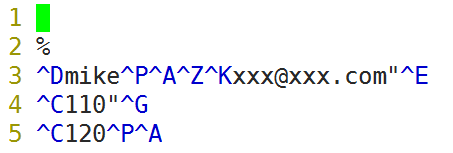
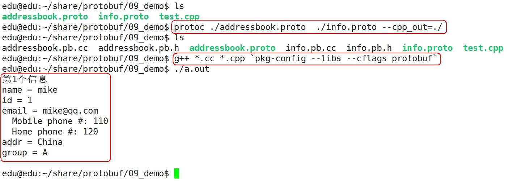

#### 简介和安装  

- **简介**

  - **什么是protobuf**

    protobuf也叫protocol buffer是google 的一种数据交换的格式，它独立于语言，独立于平台。google 提供了多种语言的实现：java、c#、c++、go 和 python，每一种实现都包含了相应语言的编译器以及库文件。

    由于它是一种二进制的格式，比使用 xml 、json进行数据交换快许多。可以把它用于分布式应用之间的数据通信或者异构环境下的数据交换。作为一种效率和兼容性都很优秀的二进制数据传输格式，可以用于诸如网络传输、配置文件、数据存储等诸多领域。

  - **protobuf的优缺点**

    - 优点

      -  性能好/效率高

      - 代码生成机制

      - 支持“向后兼容”和“向前兼容”

      -  支持多种编程语言

    - 缺点

      -  应用不够广(相比xml和json)
      - 二进制格式导致可读性差
      - 缺乏自描述

  -  **安装**

    - **Ubuntu环境搭建**

      - github源代码下载地址：https://github.com/google/protobuf

      -  本地源码包：[01_安装包\protobuf-master.zip](01_安装包)

      - 源码包中的src/README.md, 有详细的安装说明，安装过程如下：

        - 1、解压压缩包：unzip protobuf-master.zip

          2、进入解压后的文件夹：cd protobuf-master

          3、安装所需工具：sudo apt-get install autoconf automake libtool curl make g++ unzip

          4、自动生成configure配置文件：./autogen.sh

          5、配置环境：./configure

          6、编译源代码(时间比较长)：make

          7、安装：sudo make install

          8、刷新动态库：sudo ldconfig

    - **环境测试**  

      - examples例子

        - 在源代码包中，有个examples文件夹，把里面的addressbook.proto、add_person.cc、list_people.cc拷贝出来：

          

        -   编译 .proto文件  
          - 
        -  protoc：protobuf自带的编译工具，将.proto文件生成指定的类
        -  --cpp_out：将生成的C++代码文件放到等号后面指定的目录，这里也指定当前目录
        -   通过protoc工具编译.proto文件时，编译器将生成所选择语言的代码，这些代码可以操作在.proto文件中定义的消息类型，包括获取、设置字段值，将消息序列化到一个输出流中，以及从一个输入流中解析消息  
        -  对C++来说，编译器会为每个.proto文件生成一个.h文件和一个.cc文件，.proto文件中的每一个消息有一个对应的类：[02_参考代码\01_test](02_参考代码/01_test)  

      - 编译运行测试案例.

        -  写文件(序列化)  

          编译代码

          - 

          - 反引号(` 数字1前面的符号)：反引号的作用就是将反引号内的linux命令执行

          -  pkg-config 是通过库提供的一个.pc文件获得库的各种必要信息的，包括版本信息、编译和连接需要的参数等。

          -  pkg-config --cflags protobuf：列出指定共享库的预处理和编译flags

          -  pkg-config --libs protobuf：列出指定共享库的链接flags

           运行可执行程序  

          - 

            pb.xxx文件内容如下：

            

        -   读文件(反序列化  

          - 

####  protobuf的使用  

-  **操作流程**

  - 1)    在.proto文件中定义消息格式

    2)    使用protobuf编译器生成C++类

    3)    使用C++ API来读写消息				

- **消息类型**

  ```
  syntax = "proto3"; //指定版本信息，不指定会报错
  
  message Person  //message为关键字，作用为定义一种消息类型
  {
  	string name = 1;	//姓名
  	int32 id = 2;		//id
  	string email = 3; 	//邮件
  }
  
  ```

-   **消息格式**  

  **消息由至少一个字段组合而成，类似于C语言中的结构体，每个字段都有一定的格式**：

  **数据类型 字段名称 = 唯一的编号标签值;**

  **字段名称**：protobuf建议以下划线命名而非驼峰式

   **唯一的编号标签**：代表每个字段的一个唯一的编号标签，在同一个消息里不可以重复。这些编号标签用与在消息二进制格式中标识你的字段，并且消息一旦定义就不能更改。需要说明的是标签在1到15范围的采用一个字节进行编码，所以通常将标签1到15用于频繁发生的消息字段。编号标签大小的范围是1到229。此外不能使用protobuf系统预留的编号标签（19000 ~19999）。

-  **数据类型**  

  | **.proto类型** | **C++类型**     | **备注**                                                     |
  | -------------- | --------------- | ------------------------------------------------------------ |
  | double         | double          | 64位浮点数                                                   |
  | float          | float           | 32位浮点数                                                   |
  | int32          | int32           | 32位整数                                                     |
  | int64          | int64           | 64位整数                                                     |
  | uint32         | uint32          | 32位无符号整数                                               |
  | uint64         | uint64          | 64位无符号整数                                               |
  | sint32         | int32           | 32位整数，处理负数效率比int32更高                            |
  | sint64         | sint64          | 64位整数，处理负数效率比int64更高                            |
  | fixed32        | uint32          | 总是4个字节。如果数值总是比总是比228大的话，这个类型会比uint32高效。 |
  | fixed64        | uint64          | 总是8个字节。如果数值总是比总是比256大的话，这个类型会比uint64高效。 |
  | sfixed32       | int32           | 总是4个字节                                                  |
  | sfixed64       | int64           | 总是8个字节                                                  |
  | bool           | bool            | 布尔类型                                                     |
  | string         | string          | 一个字符串必须是UTF-8编码或者7-bit ASCII编码的文本           |
  | bytes          | string          | 处理多字节的语言字符、如中文                                 |
  | enum           | enum            | 枚举                                                         |
  | message        | object of class | 自定义的消息类型                                             |

  

  更多详情请看：https://developers.google.com/protocol-buffers/docs/encoding

-   **proto文件**  

  -   proto文件即消息协议原型定义文件，在该文件中我们可以通过使用描述性语言，来良好的定义我们程序中需要用到数据格式  
  - 

  通过查看头文件，可以发现针对每个字段都会大致生成如下几种函数，以name为例：

  ```
  oid clear_name();
  void set_name(const ::std::string& value);
  void set_name(const char* value);
  void set_name(const char* value, size_t size);
  const ::std::string& name() const;
  ::std::string* mutable_name();
  
  ```

  可以看出，对于每个字段会生成一个clear清除函数(clear_name)、set函数(set_name)、get函数(name和mutable_name)。

   

  这儿解释下get函数中的两个函数的区别： 对于原型为const std::string &number() const的get函数而言，返回的是常量字段，不能对其值进行修改。但是在有一些情况下，对字段进行修改是必要的，所以提供了一个mutable版的get函数，通过获取字段变量的指针，从而达到改变其值的目的。

   

#### 常用序列化/反序列化API

- C数组的序列化和反序列化

  ```
  #include "addressbook.pb.h"
  #include <iostream>
  using namespace std;
  
  /*
  //C数组的序列化和序列化API
  //在/usr/local/include/google/目录下，查找包含"SerializeToArray"所有的文件，同时打印所在行
  //sudo grep "SerializeToArray" -r /usr/local/include/google/ -n
  
  bool SerializeToArray(void* data, int size) const; //序列化
  bool ParseFromArray(const void* data, int size);   //反序列化
  */
  char buf[1024];
  int len;
  
  void set_person()
  {
  	Person obj;
  	obj.set_name("mike");
  	obj.set_id(1);
  	*obj.mutable_email() = "xxx@qq.com"; //obj.set_email("xxx@qq.com");
  
  	len = obj.ByteSize(); //获取长度
  	cout << "len = " << len << endl;
  
  	obj.SerializeToArray(buf, len);//序列化，obj成员保存在buf中
  }
  
  void get_person()
  {
  	Person obj;
  	obj.ParseFromArray(buf, len); //反序列化，buf的内容设置给obj的成员
  
  	cout << "name = " << obj.name() << endl;
  	cout << "id = " << obj.id() << endl;
  	cout << "email = " << obj.email() << endl;
  }
  
  int main()
  {
  	// Verify that the version of the library that we linked against is
  	// compatible with the version of the headers we compiled against.
  	GOOGLE_PROTOBUF_VERIFY_VERSION;
  
  	set_person(); //序列化
  	get_person(); //反序列化
  
  	// Optional:  Delete all global objects allocated by libprotobuf.
  	google::protobuf::ShutdownProtobufLibrary();
  
  	return 0;
  }
  ```

  

参考代码：[02_参考代码\02_C数组的序列化和序列化](02_参考代码/02_C数组的序列化和序列化)

​	编译运行

​	

-  **C++ String的序列化和反序列化**

  - ```
    //bool SerializeToString(string* output) const;  
    //bool ParseFromString(const string& data); 
    
    string str; //全局变量
    
    void set_person()
    {
    	Person obj;
    	obj.set_name("mike");
    	obj.set_id(1);
    	obj.set_email("xxx@qq.com");
    	//*obj.mutable_email() = "xxx@qq.com";
    
    	obj.SerializeToString(&str);	//序列化，obj成员的内容设置给str
    }
    
    void get_person()
    {
    	Person obj;
    	obj.ParseFromString(str); //反序列化, str内容设置给obj的成员
    
    	cout << "name = " << obj.name() << endl;
    	cout << "id = " << obj.id() << endl;
    	cout << "email = " << *obj.mutable_email() << endl;
    }
    
    ```

    参考代码：[02_参考代码\03_C++ String的序列化和反序列化](02_参考代码/03_C++ String的序列化和反序列化)

  

-   **文件描述符序列化和反序列化**  

  - ```
    //bool SerializeToFileDescriptor(int file_descriptor) const;  
    //bool ParseFromFileDescriptor(int file_descriptor); 
    
    void set_person()
    {
    	Person obj;
    	obj.set_name("mike");
    	obj.set_id(1);
    	obj.set_email("xxx@qq.com");
    	//*obj.mutable_email() = "xxx@qq.com";
    
    	//O_CREAT: 新建文件， O_TRUNC：清空文件，O_RDWR：读写
    	int fd = open("./pb.xxx", O_CREAT | O_TRUNC | O_RDWR, 0644);
    	if (fd <= 0)
    	{
    		perror("open");
    		exit(0);
    	}
    
    	obj.SerializeToFileDescriptor(fd);	//序列化，obj成员的内容写入fd所关联的文件中
    
    	close(fd); //关闭文件
    }
    
    void get_person()
    {
    	int fd = open("./pb.xxx", O_RDONLY); //O_RDONLY： 只读方式
    	if (fd <= 0)
    	{
    		perror("open");
    		exit(0);
    	}
    
    	Person obj;
    	obj.ParseFromFileDescriptor(fd); //反序列化, fd文件内容设置给obj的成员
    	close(fd); //关闭文件
    
    	cout << "name = " << obj.name() << endl;
    	cout << "id = " << obj.id() << endl;
    	cout << "email = " << *obj.mutable_email() << endl;
    }
    
    ```

    ​	参考代码：[02_参考代码\04_文件描述符序列化和反序列化](02_参考代码/04_文件描述符序列化和反序列化)

-    **C++ stream 序列化和反序列化**  

  - ```
    //bool SerializeToOstream(ostream* output) const;  
    //bool ParseFromIstream(istream* input);  
    
    void set_person()
    {
    	Person obj;
    	obj.set_name("mike");
    	obj.set_id(1);
    	obj.set_email("xxx@qq.com");
    	//*obj.mutable_email() = "xxx@qq.com";
    
    	fstream output("pb.xxx", ios::out | ios::trunc | ios::binary);
    
    	bool flag = obj.SerializeToOstream(&output);//序列化
    	if (!flag)
    	{
    		cerr << "Failed to write file." << endl;
    		return;
    	}
    
    	output.close();//关闭文件
    }
    
    void get_person()
    {
    	Person obj;
    	fstream input("./pb.xxx", ios::in | ios::binary);
    	obj.ParseFromIstream(&input);  //反序列化
    	input.close(); //关闭文件
    
    	cout << "name = " << obj.name() << endl;
    	cout << "id = " << obj.id() << endl;
    	cout << "email = " << *obj.mutable_email() << endl;
    }
    
    ```

    

  参考代码：[02_参考代码\05_C++ stream 序列化和反序列化](02_参考代码/05_C++ stream 序列化和反序列化)

- **repeated限定修饰符**  

  - repeated限定修饰符  

    **repeated 代表可重复，我们可以理解为数组**：

    ```
    syntax = "proto3";//指定版本信息，不指定会报错
    
    message Person //message为关键字，作用为定义一种消息类型
    {
    	string name = 1;	//姓名
    	int32 id = 2;		//id
    	string email = 3; 	//邮件
    }
    
    message AddressBook
    {
    	repeated Person people = 1;
    }
    
    ```

  -  字段API  

    -   而对于字段修饰符为repeated的字段生成的函数，则稍微有一些不同，如people字段，则编译器会为其产生如下的代码  

    - ```
      int people_size() const;
      void clear_people();
      const ::Person& people(int index) const;
      ::Person* mutable_people(int index);
      ::Person* add_people();
      ::google::protobuf::RepeatedPtrField< ::Person >* mutable_people();
      const ::google::protobuf::RepeatedPtrField< ::Person >& people() const;
      
      ```

  - 测试程序  

    - ```
      void set_addressbook()
      {
      	AddressBook obj;
      
      	Person *p1 = obj.add_people(); //新增加一个Person
      	p1->set_name("mike");
      	p1->set_id(1);
      	p1->set_email("mike@qq.com");
      
      	Person *p2 = obj.add_people(); //新增加一个Person
      	p2->set_name("jiang");
      	p2->set_id(2);
      	p2->set_email("jiang@qq.com");
      
      	Person *p3 = obj.add_people(); //新增加一个Person
      	p3->set_name("abc");
      	p3->set_id(3);
      	p3->set_email("abc@qq.com");
      
      	fstream output("pb.xxx", ios::out | ios::trunc | ios::binary);
      
      	bool flag = obj.SerializeToOstream(&output);//序列化
      	if (!flag)
      	{
      		cerr << "Failed to write file." << endl;
      		return;
      	}
      
      	output.close();//关闭文件
      }
      
      void get_addressbook()
      {
      	AddressBook obj;
      	fstream input("./pb.xxx", ios::in | ios::binary);
      	obj.ParseFromIstream(&input);  //反序列化
      	input.close(); //关闭文件
      
      	for (int i = 0; i < obj.people_size(); i++)
      	{
      		const Person& person = obj.people(i);//取第i个people
      		cout << "第" << i + 1 << "个信息\n";
      		cout << "name = " << person.name() << endl;
      		cout << "id = " << person.id() << endl;
      		cout << "email = " << person.email() << endl << endl;
      	}
      }
      
      ```

      参考代码：[02_参考代码\06_repeated限定修饰符的使用](02_参考代码/06_repeated限定修饰符的使用)

      编译运行结果：

      

#### 枚举(enum)  

- 消息格式  

   **当需要定义一个消息类型的时候，可能想为一个字段指定某“预定义值序列”中的一个值，这时候可以通过枚举实现**  

  ```
  syntax = "proto3";//指定版本信息，不指定会报错
  
  message Person //message为关键字，作用为定义一种消息类型
  {
  	string name = 1;	//姓名
  	int32 id = 2;		//id
  	string email = 3; //邮件
  
  	enum PhoneType //枚举消息类型
  	{
  		MOBILE = 0; //proto3版本中，首成员必须为0，成员不应有相同的值
  		HOME = 1;
  		WORK = 2;
  	}
  
  	message PhoneNumber
  	{
  		string number = 1;
  		PhoneType type = 2;
  	}
  
  	repeated PhoneNumber phones = 4; //phones为数组
  }
  
  message AddressBook
  {
  	repeated Person people = 1;
  }
  
  ```

  测试程序  

  ```
  void set_addressbook()
  {
  	AddressBook obj;
  
  	Person *p1 = obj.add_people(); //新增加一个Person
  	p1->set_name("mike");
  	p1->set_id(1);
  	p1->set_email("mike@qq.com");
  
  	Person::PhoneNumber *phone1 = p1->add_phones(); //增加一个phone
  	phone1->set_number("110");
  	phone1->set_type(Person::MOBILE);
  
  	Person::PhoneNumber *phone2 = p1->add_phones(); //增加一个phone
  	phone2->set_number("120");
  	phone2->set_type(Person::HOME);
  
  	fstream output("pb.xxx", ios::out | ios::trunc | ios::binary);
  
  	bool flag = obj.SerializeToOstream(&output);//序列化
  	if (!flag)
  	{
  		cerr << "Failed to write file." << endl;
  		return;
  	}
  
  	output.close();//关闭文件
  }
  
  void get_addressbook()
  {
  	AddressBook obj;
  	fstream input("./pb.xxx", ios::in | ios::binary);
  	obj.ParseFromIstream(&input);  //反序列化
  	input.close(); //关闭文件
  
  	for (int i = 0; i < obj.people_size(); i++)
  	{
  		const Person& person = obj.people(i);//取第i个people
  		cout << "第" << i + 1 << "个信息\n";
  		cout << "name = " << person.name() << endl;
  		cout << "id = " << person.id() << endl;
  		cout << "email = " << person.email() << endl;
  
  		for (int j = 0; j < person.phones_size(); j++)
  		{
  			const Person::PhoneNumber& phone_number = person.phones(j);
  
  			switch (phone_number.type())
  			{
  			case Person::MOBILE:
  				cout << "  Mobile phone #: ";
  				break;
  			case Person::HOME:
  				cout << "  Home phone #: ";
  				break;
  			case Person::WORK:
  				cout << "  Work phone #: ";
  				break;
  			}
  
  			cout << phone_number.number() << endl;
  		}
  		cout << endl;
  	}
  }
  
  ```

  参考代码：[02_参考代码\07_枚举的使用](02_参考代码/07_枚举的使用)

#### 包（Package）  

- 消息格式  

  - .proto文件新增一个可选的package声明符，用来防止不同的消息类型有命名冲突。包的声明符会根据使用语言的不同影响生成的代码。对于C++，产生的类会被包装在C++的命名空间中。

    ```
    syntax = "proto3";//指定版本信息，不指定会报错
    
    package tutorial; //package声明符
    
    message Person //message为关键字，作用为定义一种消息类型
    {
    	string name = 1;	//姓名
    	int32 id = 2;		//id
    	string email = 3; //邮件
    
    	enum PhoneType //枚举消息类型
    	{
    		MOBILE = 0; //proto3版本中，首成员必须为0，成员不应有相同的值
    		HOME = 1;
    		WORK = 2;
    	}
    
    	message PhoneNumber
    	{
    		string number = 1;
    		PhoneType type = 2;
    	}
    
    	repeated PhoneNumber phones = 4; //phones为数组
    }
    
    message AddressBook
    {
    	repeated Person people = 1;
    }
    
    ```

     测试程序  

    ```
    void set_addressbook()
    {
    	tutorial::AddressBook obj;
    
    	tutorial::Person *p1 = obj.add_people(); //新增加一个Person
    	p1->set_name("mike");
    	p1->set_id(1);
    	p1->set_email("mike@qq.com");
    
    	tutorial::Person::PhoneNumber *phone1 = p1->add_phones(); //增加一个phone
    	phone1->set_number("110");
    	phone1->set_type(tutorial::Person::MOBILE);
    
    	tutorial::Person::PhoneNumber *phone2 = p1->add_phones(); //增加一个phone
    	phone2->set_number("120");
    	phone2->set_type(tutorial::Person::HOME);
    
    	fstream output("pb.xxx", ios::out | ios::trunc | ios::binary);
    
    	bool flag = obj.SerializeToOstream(&output);//序列化
    	if (!flag)
    	{
    		cerr << "Failed to write file." << endl;
    		return;
    	}
    
    	output.close();//关闭文件
    }
    
    void get_addressbook()
    {
    	tutorial::AddressBook obj;
    	fstream input("./pb.xxx", ios::in | ios::binary);
    	obj.ParseFromIstream(&input);  //反序列化
    	input.close(); //关闭文件
    
    	for (int i = 0; i < obj.people_size(); i++)
    	{
    		const tutorial::Person& person = obj.people(i);//取第i个people
    		cout << "第" << i + 1 << "个信息\n";
    		cout << "name = " << person.name() << endl;
    		cout << "id = " << person.id() << endl;
    		cout << "email = " << person.email() << endl;
    
    		for (int j = 0; j < person.phones_size(); j++)
    		{
    			const tutorial::Person::PhoneNumber& phone_number = person.phones(j);
    
    			switch (phone_number.type())
    			{
    			case tutorial::Person::MOBILE:
    				cout << "  Mobile phone #: ";
    				break;
    			case tutorial::Person::HOME:
    				cout << "  Home phone #: ";
    				break;
    			case tutorial::Person::WORK:
    				cout << "  Work phone #: ";
    				break;
    			}
    
    			cout << phone_number.number() << endl;
    		}
    		cout << endl;
    	}
    }
    
    ```

    

参考代码：[02_参考代码\08_包（Package）的使用](02_参考代码/08_包（Package）的使用)

#### 导入定义（import）  

- 消息格式  

  - info.proto文件内容如下：

    ```
    syntax = "proto3";//指定版本信息，不指定会报错
    
    package infopack; //package声明符
    
    message info //message为关键字，作用为定义一种消息类型
    {
    	string addr = 1;	//地址
    	string group = 2; 	//分组
    }
    
    ```

    addressbook.proto文件内容如下，addressbook.proto文件需要导入info.proto文件的内容：

    ```
    syntax = "proto3";//指定版本信息，不指定会报错
    
    import "info.proto"; //导入定义
    
    package tutorial; //package声明符
    
    message Person //message为关键字，作用为定义一种消息类型
    {
    	string name = 1;	//姓名
    	int32 id = 2;		//id
    	string email = 3; //邮件
    
    	enum PhoneType //枚举消息类型
    	{
    		MOBILE = 0; //proto3版本中，首成员必须为0，成员不应有相同的值
    		HOME = 1;
    		WORK = 2;
    	}
    
    	message PhoneNumber
    	{
    		string number = 1;
    		PhoneType type = 2;
    	}
    
    	repeated PhoneNumber phones = 4; //phones为数组
    
    	//info定义在"info.proto"
    	//类型格式：包名.信息名
    	infopack.info tmp = 5;
    }
    
    message AddressBook
    {
    	repeated Person people = 1;
    }
    
    ```

    测试程序  

    ```
    #include "addressbook.pb.h"
    #include <iostream>
    #include <fstream>
    using namespace std;
    
    void set_addressbook()
    {
    	tutorial::AddressBook obj;
    
    	tutorial::Person *p1 = obj.add_people(); //新增加一个Person
    	p1->set_name("mike");
    	p1->set_id(1);
    	p1->set_email("mike@qq.com");
    
    	tutorial::Person::PhoneNumber *phone1 = p1->add_phones(); //增加一个phone
    	phone1->set_number("110");
    	phone1->set_type(tutorial::Person::MOBILE);
    
    	tutorial::Person::PhoneNumber *phone2 = p1->add_phones(); //增加一个phone
    	phone2->set_number("120");
    	phone2->set_type(tutorial::Person::HOME);
    
    	//info addr和group的使用
    	infopack::info *p_info = p1->mutable_tmp(); //取出info的对象指针
    	p_info->set_addr("China"); 	//地址
    	p_info->set_group("A");		//组
    
    	fstream output("pb.xxx", ios::out | ios::trunc | ios::binary);
    
    	bool flag = obj.SerializeToOstream(&output);//序列化
    	if (!flag)
    	{
    		cerr << "Failed to write file." << endl;
    		return;
    	}
    
    	output.close();//关闭文件
    }
    
    void get_addressbook()
    {
    	tutorial::AddressBook obj;
    	fstream input("./pb.xxx", ios::in | ios::binary);
    	obj.ParseFromIstream(&input);  //反序列化
    	input.close(); //关闭文件
    
    	for (int i = 0; i < obj.people_size(); i++)
    	{
    		const tutorial::Person& person = obj.people(i);//取第i个people
    		cout << "第" << i + 1 << "个信息\n";
    		cout << "name = " << person.name() << endl;
    		cout << "id = " << person.id() << endl;
    		cout << "email = " << person.email() << endl;
    
    		for (int j = 0; j < person.phones_size(); j++)
    		{
    			const tutorial::Person::PhoneNumber& phone_number = person.phones(j);
    
    			switch (phone_number.type())
    			{
    			case tutorial::Person::MOBILE:
    				cout << "  Mobile phone #: ";
    				break;
    			case tutorial::Person::HOME:
    				cout << "  Home phone #: ";
    				break;
    			case tutorial::Person::WORK:
    				cout << "  Work phone #: ";
    				break;
    			}
    
    			cout << phone_number.number() << endl;
    		}
    
    		//info addr和group的使用
    		infopack::info info = person.tmp(); //取出info的对象
    		cout << "addr = " << info.addr() << endl;
    		cout << "group = " << info.group() << endl;
    
    		cout << endl;
    	}
    }
    
    int main()
    {
    	// Verify that the version of the library that we linked against is
    	// compatible with the version of the headers we compiled against.
    	GOOGLE_PROTOBUF_VERIFY_VERSION;
    
    	set_addressbook(); //序列化
    	get_addressbook(); //反序列化
    
    	// Optional:  Delete all global objects allocated by libprotobuf.
    	google::protobuf::ShutdownProtobufLibrary();
    
    	return 0;
    }
    
    ```

    参考代码：[02_参考代码\09_导入定义（import）](02_参考代码/09_导入定义（import）)

    编译运行

    ​	

#### protobuf 三个关键字required、optional、repeated的理解

required关键字
顾名思义，就是必须的意思，数据发送方和接收方都必须处理这个字段，不然还怎么通讯呢

optional关键字
字面意思是可选的意思，具体protobuf里面怎么处理这个字段呢，就是protobuf处理的时候另外加了一个bool的变量，用来标记这个optional字段是否有值，发送方在发送的时候，如果这个字段有值，那么就给bool变量标记为true，否则就标记为false，接收方在收到这个字段的同时，也会收到发送方同时发送的bool变量，拿着bool变量就知道这个字段是否有值了，这就是option的意思。

这也就是他们说的所谓平滑升级，无非就是个兼容的意思。

其实和传输参数的时候，给出数组地址和数组数量是一个道理。

repeated关键字
字面意思大概是重复的意思，其实protobuf处理这个字段的时候，也是optional字段一样，另外加了一个count计数变量，用于标明这个字段有多少个，这样发送方发送的时候，同时发送了count计数变量和这个字段的起始地址，接收方在接受到数据之后，按照count来解析对应的数据即可。


