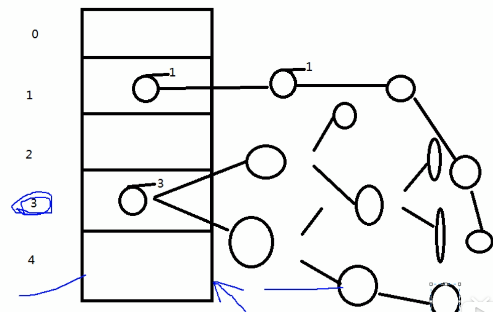

### hashmap

哈希表：底层其实就是个数组，数组中，存的都是entry.

哈希表，默认的大小是多少呢？是16

哈希表有什么好处呢？数组都有索引值。

当往里面添加对象的话，首先会调用对象的hashCode方法，根据哈希算法，对hashCode 进行运算，

运算后，生成数组的索引值，根据索引值，找到数组对应的位置。

如果当前位置没有对象在，直接存储。

相应的也会有一种情况，创建对象，**调用hashCode 方法**，生成的索引，在数组中，有对象存在，

那么，**再通过equals 比较两个对象的内容**，如果内容一样，则对象的value 覆盖掉，存在的value.

**，如果equals 比较不相同，则形成链表，在java1.7,后加入的放在前面。形成链表**。

这种情况，称为**碰撞**。这种情况，应该是尽可能去避免的，如果这里面的元素过多的话，效率低。


如果在有一个新对象，经过hashCode 生成的索引，如果跟上面所的位置一样，**则每个元素都要进行一次equals 比较**。所以数量比较多的情况，效率低下。


尽量避免：**hashCode ,equals 写的尽量严谨一些。并且让hashCode, equals 方法保持一致**。（就是对象的内容一样，生成的hashCode 一样，equals 方法返回true）

但是，尽管HashCode ,equals 写的再严谨，这种碰撞的情况也是避免不了的，只能说让它概率减少。

避免不了，也不能让当前索引的链表太长。


hashMap 提供了一种加载因子，（默认0.75），就是说，**现有元素到达哈希表的75%的时候，就进行扩容**，

一旦扩容，**则对链表中的每个元素进行重新运算，扩容以后新的位置**。（进过hash算法运算，找到新的位置），

在某种情况下，碰撞的概率就降低了。碰撞的内容就少了。

极端的情况下，里面的元素一个一个都找一遍，效率还是低，最极端的情况下，找到最后一个。


于是，在jdk1.8以后，就对它进行了改变。就不是原来的数组+链表了。而是 **数组+链表+红黑树**

什么时候，变红黑树呢？

**碰撞的个数大于8的时候，并且总元素大于64的时候**，这种时候，就把链表转换成红黑树。

转换成红黑树好在哪？

**除了添加以外，都比链表快**。（1.7 是添加到链表前面，1.8是添加到链表末尾），添加链表直接添加后面就可以了。

红黑树添加的时候，就得比较了。（比如：比红黑树的右节点大，放右边），除了添加，其他的效率都高了。


不仅如此，**而且扩容以后，换位置，也不会再进行hashCode 运算。原来哈希表的总长度 + 当前所在的位置** 就是扩容后所在的位置。




### 底层的内存结构

堆，栈，方法区（方法区属于堆的永久区的一部分）

为什么方法区属于堆的永久区的一部分，为什么画图画在堆的外面？

永久区存一些加载类的信息，核心类库，永久区的内容几乎不会被垃圾回收机制回收。

回收的条件比较苛刻。 

jvm 厂商是有很多种的，oracle-sun Hotspot 常用的， oracle  JRocket （oracle 自己的）

IBM J9 JVM ,  Taobo JVM (阿里)，几乎这些厂商都把永久区从堆区剥离出来，所以平常画，不画在堆里。


java8 以后，永久区彻底的被干掉了，取而代之的是Metaspace （元空间），这个相对于原来的方法区，有什么不同呢？

最大的不同就是Metaspace使用的是物理内存

### Lambda 表达式

lambda 是一个匿名函数，我们可以把Lambda 表达式理解为一段可以传递的代码（**将代码像数据一样进行传递**）。可以写出更简洁，更灵活的代码。作为一种更紧凑的代码风格，让java的语言表达能力得到了提升。


### **java常用接口**(四大核心函数式接口)

| 函数式接口              | 参数类型 | 返回类型 | 用途                                                         |
| ----------------------- | -------- | -------- | ------------------------------------------------------------ |
| Consumer<T>消费型接>    | T        | void     | 对类型为T的对象应用操作，包含方法，<br>void accetp(T t)      |
| Supplier<T>供给型接口   | 无       | T        | 返回类型为T的对象，包含方法：T get（）；                     |
| Function<T,R>函数型接口 | T        | R        | 对类型为T的对象应用操作，并返回结果<br>结果是R类型的对象，包含方法：R apply(T t); |
| Predicate<T>断定型接口  | T        | boolean  | 确定类型为T的对象是否满足约束，并返回boolean 值，包含方法boolean test(T  t) |

```java
package com.zkk.lambda;
import java.util.ArrayList;
import java.util.Arrays;
import java.util.List;
import java.util.function.Consumer;
import java.util.function.Function;
import java.util.function.Predicate;
import java.util.function.Supplier;

import org.junit.Test;
/**
 * java8内置 四大核心函数式接口
 * @author gzbbxu
 *Consume<T> 消费型接口
 *   void accept(T t)
 *   
 *Suplier<T>：供给型接口
 *T get
 *Function<T,R> 函数型接口
 * 	R apply(T t);
 * 
 *Predicate<T> 断言型接口
 * boolean test(T t);
 */
public class TestLambda3 {
	//Consume<T> 消费型接口 有去无回
	@Test
	public void test1(){
		happy(100,m->System.out.println("--------"+m));
	}
	
	public void happy(double money,Consumer<Double> conn){
		conn.accept(money);
	}
	
//	Suplier<T>：供给型接口  返回对象
	@Test
	public void test2(){
		List<Integer> num = getNumberList(10,()->(int)(Math.random()*100));
		for(Integer in : num){
			System.out.println(in);
		}
	}
	//需求，产生一些数，放入集合
	public List<Integer> getNumberList(int num,Supplier<Integer> sup){
		List<Integer> list =new ArrayList<Integer>();
		for(int i = 0; i< num;i++){
			list.add(sup.get());
		}
		
		return list;
		
	}
	
	//函数型接口
	//需求：处理字符串
	public void test3(){
		
		strHandler(" fdsa ",(str)->str.trim());
	}
	public String strHandler(String str,Function<String,String> fun){
		return fun.apply(str);
	}
	
	//断言接口
	//需求：将满足条件的字符串 放入集合中.
	public void test4(){
		List<String> strList  = Arrays.asList("ret","bb","dd","xx");
		filterStr(strList,(str)->str.length()>=3);
		
	}
	public List<String > filterStr(List<String> list,Predicate<String> pre){
		List<String> strList = new ArrayList<>();
		for(String str: strList){
			if(pre.test(str)){
				strList.add(str);
			}
		}
		return strList;
	}
	
}

```


### 方法引用和构造器引用

```java
package com.zkk.lambda;

import java.io.PrintStream;
import java.util.Comparator;
import java.util.function.BiFunction;
import java.util.function.BiPredicate;
import java.util.function.Consumer;
import java.util.function.Function;
import java.util.function.Supplier;

import org.junit.Test;

/**
 * 一：方法引用: 如果 lambda体中的内容，有方法已经实现了，我们可以使用“方法引用” （可以理解为方法引用是Lambda 表达式的另外一种表现形式）
 * 
 * 
 * 主要有三种表现形式 对象::实力方法名 类::静态方法名 类::实例方法名
 * 
 * 
 * 二:构造器引用
 * 
 * 格式: ClassName::new
 * 注意： 需要调用的构造器参数列表，要与函数样式接口中的抽象方法的参数列表保持一致。
 * 
 * 三：数组引用
 * Type::new
 * 
 * @author gzbbxu
 *
 */
public class TestMethodRef {
	//数组引用
	@Test
	public void test7(){
		Function<Integer,String[]> fun = (x)->new String[x];
		String[] srs = fun.apply(10);
		System.out.println(srs.length);
		
		
		Function<Integer,String[]> fun2 = String[]::new;
		String[] sts2  = fun2.apply(20);
		System.out.println(sts2.length);
	}

	// 构造器引用
	@Test
	public void test5() {

		Supplier<Employee> sup = () -> new Employee("", 1, 1);
		//构造器引用
		Supplier<Employee> sup2 = Employee::new;
		Employee emp = sup2.get();
		System.out.println(emp);
	}
	@Test
	public void test6(){
		Function<Integer,Employee> fun = (x)->new Employee(x);
		//有几个参数，就调用几个参数的 构造器
		Function<Integer,Employee> fun2 = Employee::new;
		
		
		Employee employee = fun2.apply(101);
		System.out.println(employee);
		
		
//		BiFunction<Integer, Integer, Employee> bf = Employee::new;
		
		
	}

	// 对象::实力方法名
	@Test
	public void test1() {
		Consumer<String> con = (x) -> System.out.println(x);
		PrintStream ps = System.out;

		// 需要注意的是: 需要实现的接口类的抽象方法，参数列表和返回值类型，
		// 要与当前调用的这个方法 的参数列表和返回值类型 保持一致
		Consumer<String> con1 = ps::println;

		Consumer<String> con2 = System.out::println;
		con2.accept("hello");
	}

	@Test
	public void test2() {

		Employee emp = new Employee("11", 0, 0);
		Supplier<String> sup = () -> emp.getName();
		String str = sup.get();
		System.out.println(str);

		Supplier<Integer> sup2 = emp::getAge;
		Integer num = sup2.get();
		System.out.println(num);

	}

	// 静态方法
	@Test
	public void test3() {
		Comparator<Integer> com = (x, y) -> Integer.compare(x, y);

		Comparator<Integer> com2 = Integer::compare;
	}

	// 类 ::实例方法名
	@Test
	public void test4() {
		BiPredicate<String, String> bp = (x, y) -> x.equals(y);
		// 如果 第一个参数是这个方法的调用者，第二个参数是这个方法的调用参数时，我们就可以使用类名:：方法名
		BiPredicate<String, String> bp2 = String::equals;
	}

}

```


### **强大的Stream API**

如同写sql 一样，操作java中的数据。

流是什么？

是数据渠道，用于操作数据源（集合、数组） 所产生的元素序列。

数据源：集合，数组等

对数据源 转换成流，做一系列的流水线操作，产生一个新流。而跟原来的数据源没有任何关系。**原来的数据源，不会受到任何影响**。

集合讲究的的数据，流讲的是计算。

- Stream **自己不会存储元素**
- Stream **不会改变源对象**，相反，他们会返回一个持有结果的新流
- Stream **操作是延迟的**。这意味着他们会等到需要结果时候才执行


Stream 的操作三个步骤

- 创建Stream
  - 一个数据源（集合，数组） 获取一个流
- 中间操作
  - 一个中间操作链，对数据源的数据进行处理
- 终止操作（终端操作）
  - 一个终止操作，执行中间操作链，并产生结果。

```java
package com.zkk.lambda;
import java.util.ArrayList;
import java.util.Arrays;
import java.util.List;
import java.util.stream.Stream;

import org.junit.Test;
public class TestStreamApi {
	
	//1,创建stream
	//2 中间操作
	//3 终止操作
    @Test
    public void test1(){
    	//1,可以通过Collection 系列集合的stream () 串行流 或者 parallelStream() 并行流
    	List<String> list = new ArrayList<>();
    	Stream<String> stream = list.stream();
    	
    	//2 ，通过Arrays 的静态方法stream() 获取数组流
    	Employee[] emps = new Employee[10];
    	
    	Stream<Employee> stream2 = Arrays.stream(emps);
    	
    	
    	//3 通过Stream 的of对象。
    	Stream<String> stream3 = Stream.of("aa","bb","cc");
    	
    	//4 ,创建无限流
    	//迭代
    	Stream<Integer> stream4 = Stream.iterate(0,(x)->x+2);
    	stream4.limit(10).forEach(System.out::println);
    	
    	//生成
    	Stream.generate(()->Math.random()).limit(2).forEach(System.out::println);
    	
    	
    }
}

```

```java
package com.zkk.lambda;

import java.util.ArrayList;
import java.util.Arrays;
import java.util.Iterator;
import java.util.List;
import java.util.stream.Stream;

import org.junit.Test;

public class TestStreamApi2 {

	// 中间操作
	/**
	 * 筛选与切片 filter 接收lamba ,从流中排除某些元素 limit-截断流 ，使其元素不超过给定数量 skip(n)
	 * 跳过元素，返回一个扔掉了前n个元素的流。若流中元素不足n个，则返回一个空流与limit(n)互补
	 * distinct-筛选，通过流所生成的hashCode() 和 equals() 去除重复元素。
	 */
	List<Employee> list = Arrays.asList(new Employee("张三", 18, 9999.99),
			new Employee("李四", 38, 343.99), new Employee("王五", 58, 3453543.99),
			new Employee("赵六", 38, 902.99), new Employee("田七", 80, 9239.99),
			new Employee("田七", 80, 9239.99), new Employee("田七", 80, 9239.99));

	// 内部迭代，迭代操作由stream API完成。
	@Test
	public void test1() {
		// 中间操作：不会执行任何操作
		Stream<Employee> stream = list.stream().filter((x) -> x.getAge() > 35);
		// 终止操作,一次性执行全部内容，称为“惰性求值”
		stream.forEach(System.out::println);

		// 中间操作是不会执行任何操作的，只有执行终止操作，所有的中间操作，一次性的执行全部。

		// 多个中间操作可以连接起来形成一个流水线，除非流水线上出发终止操作，否则中间操作不执行任何的处理
		// 而在终止操作时，一次性全部处理，称为“惰性求值”

	}

	// 外部迭代
	@Test
	public void test2() {
		Iterator<Employee> iterator = list.iterator();
		while (iterator.hasNext()) {
			System.out.println(iterator.next());
		}
	}

	@Test
	public void test3() {
		list.stream().filter((e) -> {
			System.out.println("短路");
			return e.getSalary() > 5000;
		}).limit(2).forEach(System.out::println);
	}

	@Test
	public void test4() {
		// 跳过
		list.stream().filter(e -> e.getSalary() > 5000).skip(2)
				.forEach(System.out::println);
	}

	@Test
	public void test5() {
		// 去重
		list.stream().filter(e -> e.getSalary() > 5000).distinct()
				.forEach(System.out::println);
	}

	/**
	 * 映射 map 接收lambda ，将元素转成其他元素或提取信息。接收一个函数作为参数， 改函数会被应用到每个元素上， 并将其映射成一个新的元素。
	 * 
	 * flatMap 接收一个函数作为参数，
	 * 
	 * 将流中的每个值都转换成另一个流，然后把所有的流 连接成一个新流
	 */

	@Test
	public void test6() {
		List<String> strlist = Arrays.asList("aa", "bb", "cc");

		strlist.stream().map((x) -> x.toUpperCase())
				.forEach(System.out::println);
		;

		list.stream().map(Employee::getName).forEach(System.out::println);

		System.out.println("======================");

		Stream<Stream<Character>> stream = strlist.stream().map(
				TestStreamApi2::filterCharacter);
		stream.forEach((sm) -> {
			sm.forEach(System.out::println);
		});

		System.out.println("======================");

		// flat 翻译 就是扁平化，平铺

		strlist.stream().flatMap(TestStreamApi2::filterCharacter);
		strlist.forEach(System.out::println);
	}

	public static Stream<Character> filterCharacter(String str) {
		List<Character> list = new ArrayList<>();
		for (Character ch : str.toCharArray()) {
			list.add(ch);
		}
		return list.stream();
	}

	/**
	 * 排序 sorted() 自然排序 Comparable sorted() Comparator 定制排序
	 */
	@Test
	public void test7() {
		List<String> strlist = Arrays.asList("dd", "bb", "cc");
		strlist.stream().sorted().forEach(System.out::println);
		list.stream().sorted((e1, e2) -> {
			if (e1.getAge() == (e2.getAge())) {
				return e1.getName().compareTo(e2.getName());
			} else {
				return Integer.compare(e1.getAge(), e2.getAge());
			}
		}).forEach(System.out::println);
	}

}

```

### Stream 的终止操作

终止操作会从流的流水线生成结果，其结果可以是任何不适流的值，例如：List,Integer 甚至 Void

### Stream的归约收集

```java
	/**
	 * 归约 将流中元素反复结合起来，得到一个值
	 */
	@Test
	public void test(){
		List<Integer> array = Arrays.asList(1,2,3,4,5,6,7,8,9,10);
		Integer sum = array.stream().reduce(0, (x,y)->x+y);   //BinaryOperator 二元运算 ,
		//启始值作为x,流中取出元素作为y,实现x+y, 把结果再作为x.
		System.out.println(sum);
		Optional<Double> optional = list.stream().map(Employee::getSalary).reduce(Double::sum);
		System.out.println(optional.get());
		//备注： map和reduce 的连接通常称为map-reduce 模式，因google 用它进行网络搜索而出名
		
		
	}
	/**
	 * 收集 ： collect --将流转换为其他形式。接收一个collector 接口的实现，用于给stream 中元素做汇总的方法。
	 */
	@Test
	public void test4(){
	   List<String> collect = list.stream().map(Employee::getName).collect(Collectors.toList());
	   for(String str: collect){
		   System.out.println(str);
	   }
	   Set<String> collect2 = list.stream().map(Employee::getName).collect(Collectors.toSet());
	   
	   
	   HashSet<String> collect3 = list.stream().map(Employee::getName).collect(Collectors.toCollection(HashSet::new));
	   collect3.forEach(System.out::println);
	}
	
	@Test
	public void test5(){
		//总数
		Long collect = list.stream().collect(Collectors.counting());
		System.out.println(collect);
		//平均
		Double avg = list.stream().collect(Collectors.averagingDouble(Employee::getSalary));
		System.out.println(avg);
		
		
		//总和
		Double double1 = list.stream().collect(Collectors.summingDouble(Employee::getSalary));
		
		System.out.println(double1);
		
		
		//最大
		Optional<Employee> collect2 = list.stream().collect(Collectors.maxBy((e1,e2)->Double.compare(e1.getSalary(), e2.getSalary())));
		System.out.println(collect2.get());
		
		
		//最小
		Optional<Double> min = list.stream().map(Employee::getSalary).collect(Collectors.minBy(Double::compare));
		System.out.println(min.get());
	}
	
	//分组
	@Test
	public void test6(){
		Map<Status, List<Employee>> collect = list.stream().collect(Collectors.groupingBy(Employee::getStatus));
		
	}
	//多级分组
	
	@Test
	public void test7(){
		Map<Status, Map<String, List<Employee>>> collect = list.stream().collect(Collectors.groupingBy(Employee::getStatus, Collectors.groupingBy(e->{
			
			if(((Employee) e).getAge()<=35){
				return "青年";
			}else if(((Employee) e).getAge()<=50){
				return "中年";
			}else{
				return "老年";
			}
		})));
		System.out.println(collect);
	}
	
	//分区 满足条件的一个区，不满足条件的另外一个区
	@Test
	public void test8(){
		Map<Boolean, List<Employee>> collect = list.stream().collect(Collectors.partitioningBy((e)->e.getSalary()>8000));
		System.out.println(collect);
		
	}
	
	//其他方式
	public void test9(){
		DoubleSummaryStatistics doubleSummaryStatistics = list.stream().collect(Collectors.summarizingDouble(Employee::getSalary));
		doubleSummaryStatistics.getAverage();
		doubleSummaryStatistics.getMax();
		doubleSummaryStatistics.getMin();
		doubleSummaryStatistics.getCount();
	}
	
	@Test
	public void test10(){
		String collect = list.stream().map(Employee::getName).collect(Collectors.joining(","));
		System.out.println(collect);
		
	}
	
```


